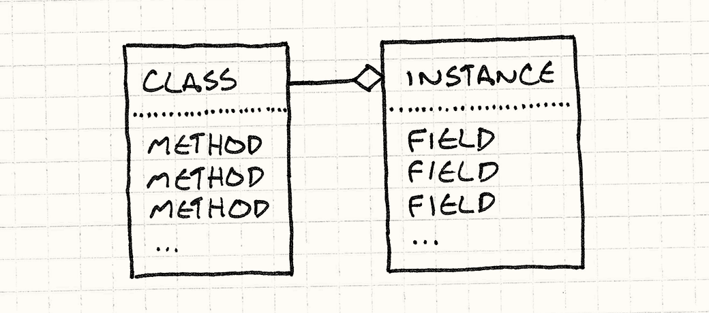
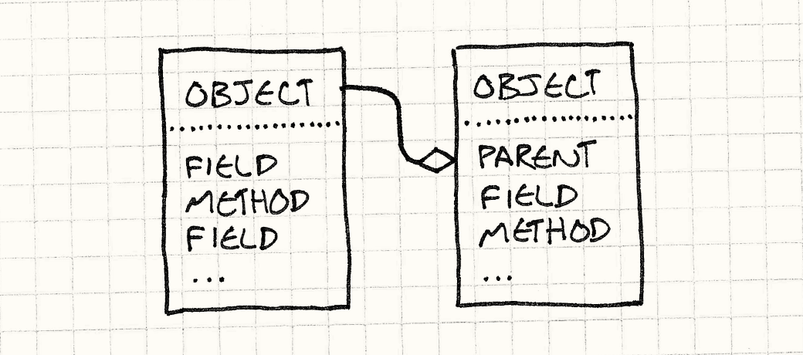
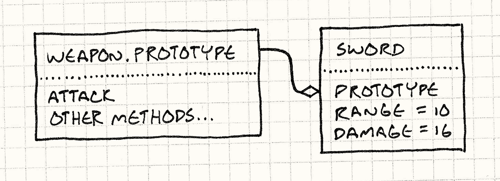

Prototype
============================
The first time I heard the word “prototype” was in Design Patterns. Today, it seems like everyone is saying it, but it turns out they aren’t talking about the [design pattern](http://en.wikipedia.org/wiki/Prototype_pattern). We’ll cover that here, but I’ll also show you other, more interesting places where the term “prototype” and the concepts behind it have popped up. But first, let’s revisit the original pattern.

### The Prototype Design Pattern

Pretend we’re making a game in the style of Gauntlet. We’ve got creatures and fiends swarming around the hero, vying for their share of his flesh. These unsavory dinner companions enter the arena by way of “spawners”, and there is a different spawner for each kind of enemy.

For the sake of this example, let’s say we have different classes for each kind of monster in the game — Ghost, Demon, Sorcerer, etc., like:

```cpp
class Monster
{
  // Stuff...
};

class Ghost : public Monster {};
class Demon : public Monster {};
class Sorcerer : public Monster {};
```

A spawner constructs instances of one particular monster type. To support every monster in the game, we could brute-force it by having a spawner class for each monster class, leading to a parallel class hierarchy:


Implementing it would look like this:

```cpp
class Spawner
{
public:
  virtual ~Spawner() {}
  virtual Monster* spawnMonster() = 0;
};

class GhostSpawner : public Spawner
{
public:
  virtual Monster* spawnMonster()
  {
    return new Ghost();
  }
};

class DemonSpawner : public Spawner
{
public:
  virtual Monster* spawnMonster()
  {
    return new Demon();
  }
};

// You get the idea...
```

Unless you get paid by the line of code, this is obviously not a fun way to hack this together. Lots of classes, lots of boilerplate, lots of redundancy, lots of duplication, lots of repeating myself…

The Prototype pattern offers a solution. The key idea is that an object can spawn other objects similar to itself. If you have one ghost, you can make more ghosts from it. If you have a demon, you can make other demons. Any monster can be treated as a prototypal monster used to generate other versions of itself.

To implement this, we give our base class, Monster, an abstract clone() method:

```cpp
class Monster
{
public:
  virtual ~Monster() {}
  virtual Monster* clone() = 0;

  // Other stuff...
};
```

Each monster subclass provides an implementation that returns a new object identical in class and state to itself. For example:

```cpp
class Ghost : public Monster {
public:
  Ghost(int health, int speed)
  : health_(health),
    speed_(speed)
  {}

  virtual Monster* clone()
  {
    return new Ghost(health_, speed_);
  }

private:
  int health_;
  int speed_;
};
```

Once all our monsters support that, we no longer need a spawner class for each monster class. Instead, we define a single one:

```cpp
class Spawner
{
public:
  Spawner(Monster* prototype)
  : prototype_(prototype)
  {}

  Monster* spawnMonster()
  {
    return prototype_->clone();
  }

private:
  Monster* prototype_;
};
```

It internally holds a monster, a hidden one whose sole purpose is to be used by the spawner as a template to stamp out more monsters like it, sort of like a queen bee who never leaves the hive.


To create a ghost spawner, we create a prototypal ghost instance and then create a spawner holding that prototype:

```cpp
Monster* ghostPrototype = new Ghost(15, 3);
Spawner* ghostSpawner = new Spawner(ghostPrototype);
```

One neat part about this pattern is that it doesn’t just clone the class of the prototype, it clones its state too. This means we could make a spawner for fast ghosts, weak ghosts, or slow ghosts just by creating an appropriate prototype ghost.

I find something both elegant and yet surprising about this pattern. I can’t imagine coming up with it myself, but I can’t imagine not knowing about it now that I do.

###How well does it work?
Well, we don’t have to create a separate spawner class for each monster, so that’s good. But we do have to implement clone() in each monster class. That’s just about as much code as the spawners.

There are also some nasty semantic ratholes when you sit down to try to write a correct clone(). Does it do a deep clone or shallow one? In other words, if a demon is holding a pitchfork, does cloning the demon clone the pitchfork too?

Also, not only does this not look like it’s saving us much code in this contrived problem, there’s the fact that it’s a contrived problem. We had to take as a given that we have separate classes for each monster. These days, that’s definitely not the way most game engines roll.

Most of us learned the hard way that big class hierarchies like this are a pain to manage, which is why we instead use patterns like Component and Type Object to model different kinds of entities without enshrining each in its own class.

#### Spawn functions
Even if we do have different classes for each monster, there are other ways to decorticate this Felis catus. Instead of making separate spawner classes for each monster, we could make spawn functions, like so:

```cpp
Monster* spawnGhost()
{
  return new Ghost();
}
```

This is less boilerplate than rolling a whole class for constructing a monster of some type. Then the one spawner class can simply store a function pointer:

```cpp
typedef Monster* (*SpawnCallback)();

class Spawner
{
public:
  Spawner(SpawnCallback spawn)
  : spawn_(spawn)
  {}

  Monster* spawnMonster()
  {
    return spawn_();
  }

private:
  SpawnCallback spawn_;
};
```

To create a spawner for ghosts, you do:

```cpp
Spawner* ghostSpawner = new Spawner(spawnGhost);
```

###Templates
By now, most C++ developers are familiar with templates. Our spawner class needs to construct instances of some type, but we don’t want to hard code some specific monster class. The natural solution then is to make it a type parameter, which templates let us do:

```cpp
class Spawner
{
public:
  virtual ~Spawner() {}
  virtual Monster* spawnMonster() = 0;
};

template <class T>
class SpawnerFor : public Spawner
{
public:
  virtual Monster* spawnMonster() { return new T(); }
};
```

Using it looks like:

```cpp
Spawner* ghostSpawner = new SpawnerFor<Ghost>();
```

#### First-class types
The previous two solutions address the need to have a class, Spawner, which is parameterized by a type. In C++, types aren’t generally first-class, so that requires some gymnastics. If you’re using a dynamically-typed language like JavaScript, Python, or Ruby where classes are regular objects you can pass around, you can solve this much more directly.

In some ways, the Type Object pattern is another workaround for the lack of first-class types. That pattern can still be useful even in languages with them, though, because it lets you define what a “type” is. You may want different semantics than what the language’s built-in classes provide.
When you make a spawner, just pass in the class of monster that it should construct — the actual runtime object that represents the monster’s class. Easy as pie.

With all of these options, I honestly can’t say I’ve found a case where I felt the Prototype design pattern was the best answer. Maybe your experience will be different, but for now let’s put that away and talk about something else: prototypes as a language paradigm.

##The Prototype Language Paradigm
Many people think “object-oriented programming” is synonymous with “classes”. Definitions of OOP tend to feel like credos of opposing religious denominations, but a fairly non-contentious take on it is that OOP lets you define “objects” which bundle data and code together. Compared to structured languages like C and functional languages like Scheme, the defining characteristic of OOP is that it tightly binds state and behavior together.

You may think classes are the one and only way to do that, but a handful of guys including Dave Ungar and Randall Smith beg to differ. They created a language in the 80s called Self. While as OOP as can be, it has no classes.

###Self
In a pure sense, Self is more object-oriented than a class-based language. We think of OOP as marrying state and behavior, but languages with classes actually have a line of separation between them.

Consider the semantics of your favorite class-based language. To access some state on an object, you look in the memory of the instance itself. State is contained in the instance.

To invoke a method, though, you look up the instance’s class, and then you look up the method there. Behavior is contained in the class. There’s always that level of indirection to get to a method, which means fields and methods are different.

For example, to invoke a virtual method in C++, you look in the instance for the pointer to its vtable, then look up the method there.



Self eliminates that distinction. To look up anything, you just look on the object. An instance can contain both state and behavior. You can have a single object that has a method completely unique to it.


If that was all Self did, it would be hard to use. Inheritance in class-based languages, despite its faults, gives you a useful mechanism for reusing polymorphic code and avoiding duplication. To accomplish something similar without classes, Self has delegation.

To find a field or call a method on some object, we first look in the object itself. If it has it, we’re done. If it doesn’t, we look at the object’s parent. This is just a reference to some other object. When we fail to find a property on the first object, we try its parent, and its parent, and so on. In other words, failed lookups are delegated to an object’s parent.



Parent objects let us reuse behavior (and state!) across multiple objects, so we’ve covered part of the utility of classes. The other key thing classes do is give us a way to create instances. When you need a new thingamabob, you can just do new Thingamabob(), or whatever your preferred language’s syntax is. A class is a factory for instances of itself.

Without classes, how do we make new things? In particular, how do we make a bunch of new things that all have stuff in common? Just like the design pattern, the way you do this in Self is by cloning.

In Self, it’s as if every object supports the Prototype design pattern automatically. Any object can be cloned. To make a bunch of similar objects, you:

1. Beat one object into the shape you want. You can just clone the base Object built into the system and then stuff fields and methods into it.

2. Clone it to make as many… uh… clones as you want.

This gives us the elegance of the Prototype design pattern without the tedium of having to implement clone() ourselves; it’s built into the system.

This is such a beautiful, clever, minimal system that as soon as I learned about it, I started creating a prototype-based language to get more experience with it.

####How did it go?
I was super excited to play with a pure prototype-based language, but once I had mine up and running, I discovered an unpleasant fact: it just wasn’t that fun to program in.

I’ve since heard through the grapevine that many of the Self programmers came to the same conclusion. The project was far from a loss, though. Self was so dynamic that it needed all sorts of virtual machine innovations in order to run fast enough.

The ideas they invented for just-in-time compilation, garbage collection, and optimizing method dispatch are the exact same techniques — often implemented by the same people! — that now make many of the world’s dynamically-typed languages fast enough to use for massively popular applications.
Sure, the language was simple to implement, but that was because it punted the complexity onto the user. As soon as I started trying to use it, I found myself missing the structure that classes give. I ended up trying to recapitulate it at the library level since the language didn’t have it.

Maybe this is because my prior experience is in class-based languages, so my mind has been tainted by that paradigm. But my hunch is that most people just like well-defined “kinds of things”.

In addition to the runaway success of class-based languages, look at how many games have explicit character classes and a precise roster of different sorts of enemies, items, and skills, each neatly labeled. You don’t see many games where each monster is a unique snowflake, like “sort of halfway between a troll and a goblin with a bit of snake mixed in”.

While prototypes are a really cool paradigm and one that I wish more people knew about, I’m glad that most of us aren’t actually programming using them every day. The code I’ve seen that fully embraces prototypes has a weird mushiness to it that I find hard to wrap my head around.

####What about JavaScript?
OK, if prototype-based languages are so unfriendly, how do I explain JavaScript? Here’s a language with prototypes used by millions of people every day. More computers run JavaScript than any other language on Earth.

Brendan Eich, the creator of JavaScript, took inspiration directly from Self, and many of JavaScript’s semantics are prototype-based. Each object can have an arbitrary set of properties, both fields and “methods” (which are really just functions stored as fields). An object can also have another object, called its “prototype”, that it delegates to if a field access fails.

As a language designer, one appealing thing about prototypes is that they are simpler to implement than classes. Eich took full advantage of this: the first version of JavaScript was created in ten days.
But, despite that, I believe that JavaScript in practice has more in common with class-based languages than with prototypal ones. One hint that JavaScript has taken steps away from Self is that the core operation in a prototype-based language, cloning, is nowhere to be seen.

There is no method to clone an object in JavaScript. The closest it has is Object.create(), which lets you create a new object that delegates to an existing one. Even that wasn’t added until ECMAScript 5, fourteen years after JavaScript came out. Instead of cloning, let me walk you through the typical way you define types and create objects in JavaScript. You start with a constructor function:

```cpp
function Weapon(range, damage) {
  this.range = range;
  this.damage = damage;
}
```

This creates a new object and initializes its fields. You invoke it like:

```cpp
var sword = new Weapon(10, 16);
```

The new here invokes the body of the Weapon() function with this bound to a new empty object. The body adds a bunch of fields to it, then the now-filled-in object is automatically returned.

The new also does one other thing for you. When it creates that blank object, it wires it up to delegate to a prototype object. You can get to that object directly using Weapon.prototype.

While state is added in the constructor body, to define behavior, you usually add methods to the prototype object. Something like this:

```cpp
Weapon.prototype.attack = function(target) {
  if (distanceTo(target) > this.range) {
    console.log("Out of range!");
  } else {
    target.health -= this.damage;
  }
}
```

This adds an attack property to the weapon prototype whose value is a function. Since every object returned by new Weapon() delegates to Weapon.prototype, you can now call sword.attack() and it will call that function. It looks a bit like this:



Let’s review:

- The way you create objects is by a “new” operation that you invoke using an object that represents the type — the constructor function.

- State is stored on the instance itself.

- Behavior goes through a level of indirection — delegating to the prototype — and is stored on a separate object that represents the set of methods shared by all objects of a certain type.

Call me crazy, but that sounds a lot like my description of classes earlier. You can write prototype-style code in JavaScript (sans cloning), but the syntax and idioms of the language encourage a class-based approach.

Personally, I think that’s a good thing. Like I said, I find doubling down on prototypes makes code harder to work with, so I like that JavaScript wraps the core semantics in something a little more classy.

##Prototypes for Data Modeling
OK, I keep talking about things I don’t like prototypes for, which is making this chapter a real downer. I think of this book as more comedy than tragedy, so let’s close this out with an area where I do think prototypes, or more specifically delegation, can be useful.

If you were to count all the bytes in a game that are code compared to the ones that are data, you’d see the fraction of data has been increasing steadily since the dawn of programming. Early games procedurally generated almost everything so they could fit on floppies and old game cartridges. In many games today, the code is just an “engine” that drives the game, which is defined entirely in data.

That’s great, but pushing piles of content into data files doesn’t magically solve the organizational challenges of a large project. If anything, it makes it harder. The reason we use programming languages is because they have tools for managing complexity.

Instead of copying and pasting a chunk of code in ten places, we move it into a function that we can call by name. Instead of copying a method in a bunch of classes, we can put it in a separate class that those classes inherit from or mix in.

When your game’s data reaches a certain size, you really start wanting similar features. Data modeling is a deep subject that I can’t hope to do justice here, but I do want to throw out one feature for you to consider in your own games: using prototypes and delegation for reusing data.

Let’s say we’re defining the data model for the shameless Gauntlet rip-off I mentioned earlier. The game designers need to specify the attributes for monsters and items in some kind of files.

I mean completely original title in no way inspired by any previously existing top-down multi-player dungeon crawl arcade games. Please don’t sue me.
One common approach is to use JSON. Data entities are basically maps, or property bags, or any of a dozen other terms because there’s nothing programmers like more than inventing a new name for something that already has one.

We’ve re-invented them so many times that Steve Yegge calls them “The Universal Design Pattern”.
So a goblin in the game might be defined something like this:

```cpp
{
  "name": "goblin grunt",
  "minHealth": 20,
  "maxHealth": 30,
  "resists": ["cold", "poison"],
  "weaknesses": ["fire", "light"]
}

```

This is pretty straightforward and even the most text-averse designer can handle that. So you throw in a couple of sibling branches on the Great Goblin Family Tree:

```cpp
{
  "name": "goblin wizard",
  "minHealth": 20,
  "maxHealth": 30,
  "resists": ["cold", "poison"],
  "weaknesses": ["fire", "light"],
  "spells": ["fire ball", "lightning bolt"]
}

{
  "name": "goblin archer",
  "minHealth": 20,
  "maxHealth": 30,
  "resists": ["cold", "poison"],
  "weaknesses": ["fire", "light"],
  "attacks": ["short bow"]
}
```

Now, if this was code, our aesthetic sense would be tingling. There’s a lot of duplication between these entities, and well-trained programmers hate that. It wastes space and takes more time to author. You have to read carefully to tell if the data even is the same. It’s a maintenance headache. If we decide to make all of the goblins in the game stronger, we need to remember to update the health of all three of them. Bad bad bad.

If this was code, we’d create an abstraction for a “goblin” and reuse that across the three goblin types. But dumb JSON doesn’t know anything about that. So let’s make it a bit smarter.

We’ll declare that if an object has a "prototype" field, then that defines the name of another object that this one delegates to. Any properties that don’t exist on the first object fall back to being looked up on the prototype.

This makes the "prototype" a piece of metadata instead of data. Goblins have warty green skin and yellow teeth. They don’t have prototypes. Prototypes are a property of the data object representing the goblin, and not the goblin itself.
With that, we can simplify the JSON for our goblin horde:

```cpp
{
  "name": "goblin grunt",
  "minHealth": 20,
  "maxHealth": 30,
  "resists": ["cold", "poison"],
  "weaknesses": ["fire", "light"]
}

{
  "name": "goblin wizard",
  "prototype": "goblin grunt",
  "spells": ["fire ball", "lightning bolt"]
}

{
  "name": "goblin archer",
  "prototype": "goblin grunt",
  "attacks": ["short bow"]
}
```

Since the archer and wizard have the grunt as their prototype, we don’t have to repeat the health, resists, and weaknesses in each of them. The logic we’ve added to our data model is super simple — basic single delegation — but we’ve already gotten rid of a bunch of duplication.

One interesting thing to note here is that we didn’t set up a fourth “base goblin” abstract prototype for the three concrete goblin types to delegate to. Instead, we just picked one of the goblins who was the simplest and delegated to it.

That feels natural in a prototype-based system where any object can be used as a clone to create new refined objects, and I think it’s equally natural here too. It’s a particularly good fit for data in games where you often have one-off special entities in the game world.

Think about bosses and unique items. These are often refinements of a more common object in the game, and prototypal delegation is a good fit for defining those. The magic Sword of Head-Detaching, which is really just a longsword with some bonuses, can be expressed as that directly:

```cpp
{
  "name": "Sword of Head-Detaching",
  "prototype": "longsword",
  "damageBonus": "20"
}
```

A little extra power in your game engine’s data modeling system can make it easier for designers to add lots of little variations to the armaments and beasties populating your game world, and that richness is exactly what delights players.
