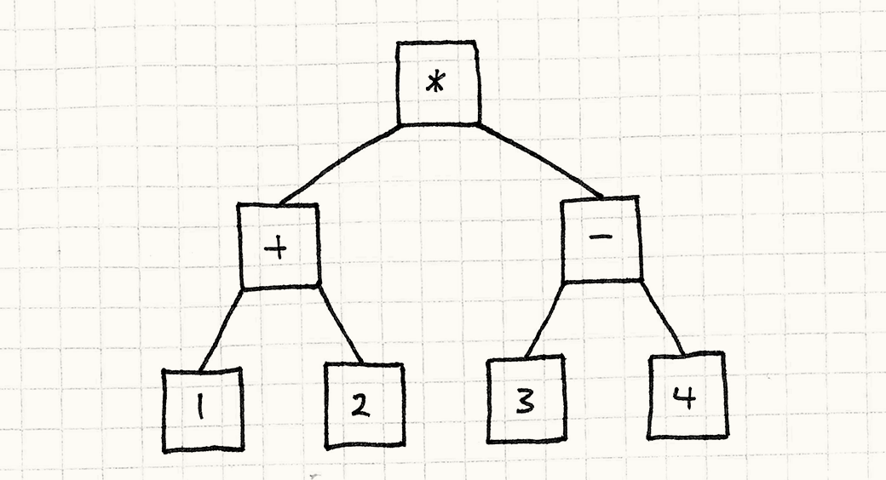

字节码
============================

## 意图
通过将行为编码成虚拟机指令，而使其具备数据的灵活性。

## 动机

> 我曾参与一款有600万行C++代码的游戏。比较起来火星探测车“好奇号”的控制软件的代码量还不及它的一半。

制作游戏很有趣，但也不容易。现在的游戏需要庞大复杂的数据库。主机厂商和应用商店有严格的质量要求，一个造成崩溃的Bug就可能导致你的游戏无法发布。

与此同时，我们期许能榨干平台所能提供的全部性能。我们要不遗余力地进行优化，以跟上游戏所推动硬件进步。

为了获得高稳定性和效率，我们会选择像C++这样的重量级语言。它们兼具充分利用硬件的能力以及可以阻止或拦截Bug的强类型系统。

我们可以为此感到骄傲，但它也有代价。多年的专业训练才能造就一个精通的程序员，随后你又必须面对庞大的代码库。大型游戏的编译时间可以短到“喝杯咖啡”，也可以长到“自己煮咖啡豆、磨咖啡豆、倒咖啡、打奶泡、练练拿铁的拉花”。

除了这些挑战外，游戏还有个讨厌的约束：有趣。玩家需要的是既新奇又具平衡性的体验。这就需要持续迭代。如果每个小修小改都都得一个工程师去动底层代码，然后等待漫长的重编译，那实际上你已经毁了整个创作流程。

### 魔法大战！
比如说，我们在开发一款基于魔法的战斗游戏。两个对峙的法师不断向对方丢法术，直到其中一个取得胜利。我们可以在代码中定义法术，但这意味着每次修改都需要工程师介入。当一个设计师想要改些数字，试试感觉，这需要重新编译整个游戏，重启然后重新进入战斗。

在游戏发布之后，我们得像其他游戏一样去更新它，包括修正Bug以及添加内容等。如果所有的法术都被硬编码，一次更新就等价于发一次可执行文件的补丁。

进一步来说，如果要支持MOD，要让用户自己创建法术。如果它们都在代码里面，那这些用户都需要有完整的编译工具链去构建游戏，我们得公开所有源码。况且，如果他们的法术有Bug，其他玩家可能受到殃及而造成游戏崩溃。


### Data > code
很明显，我们引擎所使用的编程语言不适合解决这个问题。我们需要把法术从游戏核心移动到安全沙箱中。我们要给让它们易于修改，易于重新加载并且在物理上与游戏的可执行文件相分离。

我不知道你怎么看，这种形式在我看来更像是种*数据*。我们可以在单独的数据文件中定义行为，游戏引擎可以以某种方式加载并“执行”它们。这样一来就达到了我们的目的。

我们只需要弄明白“执行”这些数据的方法。怎样才能让文件中的字节表示行为呢？有好几种方法。参照一下[解释器](http://en.wikipedia.org/wiki/Interpreter_pattern)模式，你就能对此模式的优缺点全貌有个大致了解。

### 解释器模式
本来这个模式我可以写成一整章的，但是有四个家伙已经替我说了。所以，这里我仅做一些简介。我们从一个语言开始——你可以类比编程语言——你要去执行它。举个例子。它支持下面的数学表达式：

```c++
(1 + 2) * (3 - 4)
```

然后，你拿出表达式中的每个片段、语言语法中的每个规则，将它们变成对象。数字的对象就是它们的字面值。


简单来说，它们是在原始数值的基础上，做了个小封装。运算符也是对象，它们拥有对操作数的引用。如果你使用括号来控制优先级的话，这个表达式又变成了一棵小对象树：

> 这个“变化”究竟是什么？很简单——解析。解析器接受输入文本字符串，然后将它变成抽象的语法树，即一组用于表示文本语法结构的对象。

> 把上述内容堆积起来，你就拥有了半个编译器。



解释器模式与创建语法树无关，它只关心如何执行它。它的处理很聪明，树中的每个对象都是表达式或子表达式。在面向对象风格中，表达式会计算它们自己的值。

首先，定义一个所有表达式都要实现的基础接口。

```c++
class Expression
{
public:
  virtual ~Expression() {}
  virtual double evaluate() = 0;
};
```

然后为每一个语法定义实现这个接口的类。其中，最简单的是数字：
```c++
class NumberExpression : public Expression
{
public:
  NumberExpression(double value)
  : value_(value)
  {}

  virtual double evaluate()
  {
    return value_;
  }

private:
  double value_;
};
```

一个字面数字表达式的值就等同于它的数值。加法和乘法要稍微复杂一些，因为他们包含子表达式。它们需要先递归计算出所有子表达式的值，之后才能计算出它们自己的值。像这样：

```c++
class AdditionExpression : public Expression
{
public:
  AdditionExpression(Expression* left, Expression* right)
  : left_(left),
    right_(right)
  {}

  virtual double evaluate()
  {
    // Evaluate the operands.
    double left = left_->evaluate();
    double right = right_->evaluate();

    // Add them.
    return left + right;
  }

private:
  Expression* left_;
  Expression* right_;
};
```

