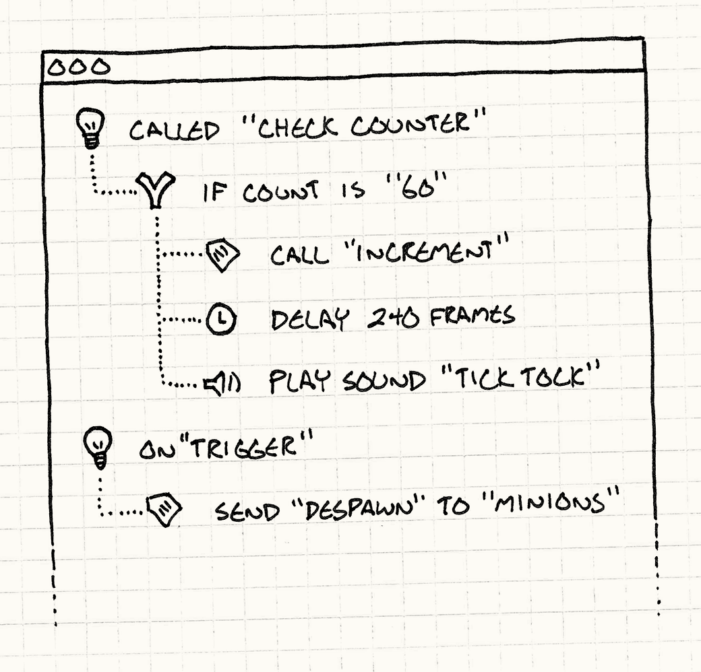

字节码
============================

## 目的
通过将行为编码成虚拟机指令，而使其具备数据的灵活性。

## 动机

> 我曾参与一款有600万行C++代码的游戏。比较起来火星探测车“好奇号”的控制软件的代码量还不及它的一半。

制作游戏很有趣，但也不容易。现在的游戏需要庞大复杂的代码库。主机厂商和应用商店有严格的质量要求，一个造成崩溃的Bug就可能导致你的游戏无法发布。

同时，我们希望将平台的性能发挥到极致。游戏的发展推动着硬件发展,我们当然要不遗余力地进行优化来赶上发展的脚步。

为了提高高稳定性和效率，我们会选择像C++这样的重量级语言。它们兼具充分利用硬件的能力以及可以阻止或拦截Bug的强类型系统。

我们可以为此感到骄傲，但它也有代价。多年的专业训练才能造就一个精通的程序员，随后你又必须面对庞大的代码库。大型游戏的编译时间可以短到“喝杯咖啡”，也可以长到把“自己煮咖啡豆、磨咖啡豆、倒咖啡、打奶泡、练练拿铁的拉花”都给搞定。

除了这些挑战外，游戏还有个额外的苛求：有趣。玩家需要的是既新奇又具平衡性的体验。这就需要持续迭代。如果每个小修小改都都得一个工程师去动底层代码，然后等待漫长的重编译，那实际上你已经毁了整个创作流程。

### 魔法大战！
比如说，我们在开发一款基于魔法的战斗游戏。两个对峙的法师不断向对方释放法术直到分出胜负。我们可以在代码中定义法术，但这意味着每次修改都需要工程师介入。当一个设计师想要改些数值并测试效果，就需要重新编译整个游戏，重启然后重新进入战斗。

在游戏发布之后，我们得像其他游戏一样去更新它，包括修正Bug以及添加内容等。如果所有的法术都被硬编码，一次更新就等价于发一次可执行文件的补丁。

进一步，设想提供一个MOD系统以供用户自己创建法术。如果它们都在代码里面，那这些用户都需要有完整的编译工具链去构建游戏，我们得公开所有源码。况且，如果他们的法术有Bug，其他玩家可能受到殃及而造成游戏崩溃。

### 先数据后编码
很明显，我们引擎所使用的编程语言不适合解决这个问题。我们需要把法术从游戏核心移动到安全沙箱中。我们要给让它们易于修改，易于重新加载并且在物理上与游戏的可执行文件相分离。

这种形式在我看来更像是种*数据*，你或许也会这么想。我们可以在单独的数据文件中定义行为，游戏引擎可以某种方式加载并“执行”它们，那么问题就解决了。

我们只需要弄明白对于数据，何谓“执行”。怎样才能让文件中的字节表示行为呢？有好几种方法。参照一下[解释器](http://en.wikipedia.org/wiki/Interpreter_pattern)模式，你就能对此模式的优缺点全貌有个大致了解。

### 解释器模式
本来这个模式我可以写成一整章的，但是Gof早已替我写了。所以这里我仅做简述。我们从一个语言开始——比如某种编程语言——你要执行它。例如它支持下面的数学表达式：

```c++
(1 + 2) * (3 - 4)
```

然后，你拿出表达式中的每个片段、语言语法中的每个规则，将它们变成对象。数字的对象就是它们的字面值。


简单来说，它们是在原始数值的基础上，做了个小封装。运算符也是对象，它们拥有对操作数的引用。如果你使用括号来控制优先级的话，这个表达式又变成了一棵小对象树：

> 这个“变化”究竟是什么？很简单——解析。解析器接受输入文本字符串，然后将它变成抽象的语法树，即一组用于表示文本语法结构的对象。

> 把上述内容堆积起来，你就完成了编译器一半的工作。


解释器模式与创建语法树无关，它只关心如何执行它。它的处理很聪明，树中的每个对象都是表达式或子表达式。在面向对象风格中，表达式会计算它们自己的值。

首先，定义一个所有表达式都要实现的基础接口。

```c++
class Expression
{
public:
  virtual ~Expression() {}
  virtual double evaluate() = 0;
};
```

然后为每一个语法定义实现这个接口的类。其中，最简单的是数字：
```c++
class NumberExpression : public Expression
{
public:
  NumberExpression(double value)
  : value_(value)
  {}

  virtual double evaluate()
  {
    return value_;
  }

private:
  double value_;
};
```

一个字面数字表达式的值就等同于它的数值。加法和乘法要稍微复杂一些，因为他们包含子表达式。它们需要先递归计算出所有子表达式的值，之后才能计算出它们自己的值。像这样：

```c++
class AdditionExpression : public Expression
{
public:
  AdditionExpression(Expression* left, Expression* right)
  : left_(left),
    right_(right)
  {}

  virtual double evaluate()
  {
    // Evaluate the operands.
    double left = left_->evaluate();
    double right = right_->evaluate();

    // Add them.
    return left + right;
  }

private:
  Expression* left_;
  Expression* right_;
};
```

显然，只要几个简单的类，就能够表达任何复杂的算术表达式了。我们只用创建几个对象，并将它们正确得关联起来。

> Ruby在大概15年前就是这么实现的。到了1.9版本，它们改成了本章所说的字节码。看我替你省了多少时间！

这个模式虽然简单漂亮，但是也有些问题。回头看看上面的插图，你看到了些什么？很多小盒子，以及它们之间的箭头。代码用一个微小对象构成的蔓生分形树来表达，会有一些副作用：
- 从磁盘加载需要实例化并串联成堆的小对象。
> 如果你想自己算算的话，别忘了算上虚函数表。
- 些对象和它们之间的指针占用大量内存。在32位机上，即使不考虑内存对齐，这个小小的表达式也要占用68字节(4字节/指针*17个指针)。
> 要了解更多关于缓存以及它如何影响性能的原理，看看[数据局部性](06.1-Data%20Locality.md)这一章。
- 从每个指针遍历出表达式都会废了你的数据缓存，而虚函数调用也会对指令缓存造成很大压力。

一个字概括，慢！大量的编程语言不采用解释器模式，就是因为它又慢又占内存。

### 虚拟机器码
回到我们的游戏。当它运行时，计算机并不会去遍历C++语法结构树，而是执行我们在编译期编译成的机器码。那么为什么要采用机器码呢？
- 高密度。它是坚实持续的二进制数据块，不浪费任何一个字节。
- 线性。指令被打包在一起顺序执行。不会在内存中跳跃访问（当然了，除非你确实在做流程控制）
- 底层。每个单独的指令仅仅完成一小个动作，各种有趣行为都是这些小动作的组合。
- 高速。以上几点让机器码疾行如风（当然还得算上机器码由硬件实现这一点了）。

听上去激动人心，但我们不想直接用机器码来编写法术。为用户提供游戏执行的机器码，简直是自找麻烦，这会带来很多安全问题。我们只能在机器码的效率和解释器模式的安全性之间取一个折中。

> 这就是为什么很多主机和iOS系统禁止程序在运行时生成或载入机器码的原因。这反倒是个拖累，因为最快的编程语言就是基于这个原理实现的。它们包含一个准时(“just-in-time”)编译器，或者叫JIT。它能飞快地把语言翻译成优化的机器码。

我们不要去加载执行真正的机器码，而去定义自己的虚拟机器码，会怎样呢？我们在游戏中实现一个执行它们的模拟器。这些虚拟机器码与机器码相似——高密度、线性、相对底层——同时它完全接受游戏安全的管理。

> 在编程语言的语境下，“虚拟机”和“解释器”是同义词，我正是交替地使用它们。如果要说Gof的解释器模式的话，我会强调“模式”这个词，以避免混淆。

我们将这个小模拟器称为虚拟机（简称VM），这个虚拟机所执行的语义上的“二进制机器码”称为字节码。它具备从数据定义事物的灵活性和易用性，它也比解释器模式这种高级呈现方式更高效。

听上去挺吓人的。我在本章里剩下的目标，就是要给你展示一下，如果你控制好自己的功能清单，这个方案非常可行。即使最终你自己也没把这个模式用起来，至少你能对Lua以及别的采用这个原理的语言有更好的了解。

## (解释器)模式
**指令集**定义可以执行的底层操作。一系列指令被编码为**字节序列**。**虚拟机**逐条执行指令栈上的指令。通过组合指令，即可完成很多高级行为。

## 使用情境
这是本书中最复杂的模式，它可是不是轻易就能放进你的游戏里。仅当你的游戏中需要定义大量行为，并实现游戏的语言没法处理好下列事情时可以使用：
- 编程语言太底层了，编写起来繁琐易错
- 因编译时间太长或工具问题，导致迭代缓慢
- 它的安全性太依赖编码者。你想确保定义的行为不会让程序崩溃，就得把它们放进安全沙箱里。
当然，这个列表符合大多数游戏的情况。谁不想提高迭代速度，让程序更安全？但那是有代价的。字节码比本地码要慢，所以它并不适合用作对性能要求极高的核心部分。

## 注意
建立你自己的语言或内嵌系统是一件很有吸引力的事。这里我只做个最小化示例，但在实际项目中，麻烦可多多了。

> 这也正是游戏开发吸引我的地方，二者不论是哪个，我都在努力创建虚拟世界，让别人进来玩或做创意。

每当我看到有人创造出一种小语言或脚本，他们会说“别担心，它会很小巧”。没法控制的是，他们会不断往里面添加小功能，直到它变成一个成熟的语言。但不像其他语言，它的发展是一些临时功能的有机组合，就像个精致的棚屋小镇。

> 任何一种的模板语言都是这样

当然，做个成熟的语言没什么错。只要保证你目标明确。否则，就控制好你的字节码要表达的东西，在它超出你控制之前设定好范围。

### 你需要个前端
低级的字节码对性能提升很大，但你没法让你的用户直接编写它们。我们将行为从代码中移出来的一个原因是想在更高一级的层面表述它。C++已经很底层了，如果让你的用户用更高效的汇编语言编写——这根本不是种进步！  

>  一个反例是有名的[RoboWar](http://en.wikipedia.org/wiki/RoboWar)。在这个游戏里，玩家使用一种类似汇编的语言编写小程序，来控制机器人。我们这里也会讨论指令集这种方式。
> 这是我的第一篇汇编类语言的指南。

就像Gof的解释器模式一样，它假定你能够以某种方式生成字节码。通常，用户会在更高级的层次上编辑，一个工具负责将它转换成虚拟机能够理解的字节码。这个工具的名字，就是编译器。

我知道，听上去很可怕对不对。所以这里我先提出来了。如果你没有足够的资源去完成一个编辑工具，那么字节码不适合你。但你先别急继续往下看，也许没你想象中那么坏。

### 你会想念调试器的
编程很难。我们知道自己想让机器做什么，但是我们很难用正确的方式与之沟通——我们会写出bug。为此，我们搜集了一大堆工具来找出代码错在哪里，如何去改正。我们有调试器、静态分析器、反编译工具等等。所有这些工具都是为某种已经存在的语言而设计的：机器码或者是高级语言。

当你定义自己的字节码虚拟机时，你就没法用这些工具了。当然了，你可以用调试器步进到虚拟机的代码里，但那只能告诉你虚拟机在做什么，与它正在解释的字节码没什么关系。它也没法替你把字节码映射回对应的原始高级语言。

如果你定义的行为很简单，你可以勉强回避掉做各种辅助调试工具的事儿。但是随着内容规模增长，你得规划好如何让用户能实时看到他们的字节码有什么效果。这些功能可能不会随游戏发布，但是它们能确保你的游戏可以发布。

> 当然，如果你想让游戏支持MOD，你就得发布这些功能，这相当重要。

## 示例
在上面几节讨结束之后，你可能会很好奇如何直接实现它。首先，要为虚拟机设计一个指令集。在真正考虑字节码之类的东西前，可以先把它们当成是API。


### 法术API
假设我们要直接用C＋＋代码去实现各种法术，我们需要让代码调用哪些API呢？为了定义法术，引擎中要定义哪些基础操作呢？

绝大多数法术会改变巫师的一个状态，我们就从这里开始：

    void setHealth(int wizard, int amount);
    void setWisdom(int wizard, int amount);
    void setAgility(int wizard, int amount);

第一个参数定义受到影响的巫师，比如说用0代表玩家，用1代表对手。这样以来，治疗法术就能够施加到玩家自己的巫师身上，同时也可以伤害到对手。毋庸置疑，这三个小函数会神奇得支持非常广泛的法术效果。

然而如果法术只是静默得改变状态，游戏逻辑上不会有问题，但是玩这样的游戏会让玩家无聊到哭的。我们来做些调整：

    void playSound(int soundId);
    void spawnParticles(int particleType);

这些不会影响到玩法，但是会增加游戏的深度。我们还会添加摄像机抖动、动画等等。但是这些就足够我们开始了。

### 法术指令集
现在让我们看看如何将这些程序API转换成数据可控的形式。让我们由简入繁来完成整件事。首先拿掉这些函数中所有的参数。假设所有的set_ _ _()函数都会影响玩家控制的法师并强化其对应属性。类似的，FX操作们会播放一个硬编码的音效或者粒子特效。

在这个前提之下，法术就是一系列的指令。每个指令定义一个你想要执行的操作。我们可以枚举他们：

    enum Instruction { 
        INST_SET_HEALTH = 0x00, 
        INST_SET_WISDOM = 0x01, 
        INST_SET_AGILITY = 0x02, 
        INST_PLAY_SOUND = 0x03, 
        INST_SPAWN_PARTICLES = 0x04 
    };

为了将法术编码成数据，我们存储一系列枚举值在数组中。我们的仅有几种基本操作，所以枚举值长度取一个字节足矣，这意味着法术的代码都是一个字节列表——所谓的字节码。

一些字节码虚拟机使用多个字节去存储单个指令，这需要有更加复杂的解码规则。实际上常见芯片上的机器码，比如x86，就更加复杂了。

但是单字节对于[Java Virtual Machine]() 以及 Microsoft .NET 平台的基石[Common Language Runtime]()来说已经很够用了，所以对我们来说已经可以了。

执行一条指令时，我们首先找到对应的基础方法，然后调用正确的API：

    class VM { 
        public: 
        void interpret(char bytecode[], int size) {
            for (int i = 0; i < size; i++) { 
                char instruction = bytecode[i]; 
                switch (instruction) { 
                    // Cases for each instruction... 
                } 
            } 
        } 
    };

把这段代码写进去，你就完成了你的第一个虚拟机。可惜它还不够灵活。我们没办法去定义一个能够伤害到对手或者削弱某个属性的法术。我们只能播放段声音而已。

为了多一点真正语言的感觉，我们这里需要加入参数。

## 栈机

要执行一个复杂的嵌套表达式，你从最内层的子表达式开始。计算完的内层表达式的结果，就将结果作为包含它们的外层表达式的参数传给外层表达式进行计算，以此类推直到整个表达式计算完毕。

解释器模式将这一过程显式建模成一棵嵌套对象树，但我们想要获得像指令列表一样的高速度。同时要保证自表达式的结果能够正确的传入外层表达式。但由于我们的数据是被展平的，我们得通过指令的顺序去控制。我们会采用与你的CPU相同的方式——一个堆栈。

> 理所当然,这个架构就称为栈机。例如Forth、PostScript和Factor这类编程语言将这个模型直接暴露给了用户。

    class VM { 
        public: 
        VM() : stackSize_(0) {} // Other stuff... private: 
        static const int MAX_STACK = 128; 
        int stackSize_; 
        int stack_[MAX_STACK]; 
    };

这个虚拟机内部包含了一个值堆栈。在我们的例子中，与指令相关的唯一数据类型是数字，所以我们可以使用一个int型数组。当一段数据要求指令一个一个执行下去时，实际上就是在遍历堆栈。

字面意思，数值可以被压入或者弹出这个堆栈。因此，让我们添加些方法来实现这个功能：

    class VM { 
        private: 
        void push(int value) { 
            // Check for stack overflow. 
            assert(stackSize_ < MAX_STACK); 
            stack_[stackSize_++] = value; 
        } 
        int pop() { 
            // Make sure the stack isn't empty. 
            assert(stackSize_ > 0); 
            return stack_[--stackSize_]; 
        } 
        // Other stuff... 
    };

当哪一个指令需要输入参数时，它会按照下面的方式从堆栈中弹出来：

    switch (instruction) { 
        case INST_SET_HEALTH: { 
            int amount = pop(); 
            int wizard = pop(); 
            setHealth(wizard, amount); 
            break; 
        } 
        case INST_SET_WISDOM: 
        case INST_SET_AGILITY: 
            // Same as above... 
        case INST_PLAY_SOUND: 
            playSound(pop()); 
            break; 
        case INST_SPAWN_PARTICLES: 
            spawnParticles(pop()); 
            break; 
    }

为了向堆栈中添加一些数值，我们需要一个新的指令：字面值。它表示一个字面上的整数数值。但是它又从哪里获得这个值呢？这里究竟该如何避免无限循环呢？

这个小技巧就是利用指令流是字节序列的特性－－我们可以将数字直接塞进字节数组。我们用如下方式定义一个字面数字的指令类型：

    case INST_LITERAL: { 
        // Read the next byte from the bytecode. 
        int value = bytecode[++i]; 
        push(value); 
        break; 
    }

> 这里，为了避开处理多字节整型的情况，我仅读取单字节整数，但是在实际实现中，你肯定想要支持所有你所需范围的整数参数。

它读取了字节码流中的下一个字节，将它当作一个数字写入堆栈。

为了能够对堆栈的工作方式有个直观感受，我们把几条指令串起来，看看它们如何被解释器执行。从一个空栈开始，解释器指向第一个指令：

首先，它执行第一个 INST_LITERAL。他会读取从bytecode(0)开始的下一个字节，并将它压入堆栈。

然后，它执行第二个 INST_LITERAL。它读取数字10，并将其压入堆栈。

最后，它执行 INST_SET_HEALTH。它会出栈10并将其存储到变量`amount`中，然后出栈0将其存储到`wizard`中。之后，使用这两个参数调用setHealth()。

嗒哒！我们完成了一个将玩家巫师的生命值设定为10点的法术。现在，我们就拥有了足够的灵活性，来把任何巫师的状态设定到任何想要的值。我们也可以播放不同的音效以及发粒子。

但是，这感觉更像是数据结构。我们没法做到诸如将巫师的生命提高其法力值的一半。我们的设计师想要制定法术的计算规则，而不仅仅是数值。


###组合就能得到行为

如果将我们的虚拟机看做是一种编程语言，它所支持的仅仅是些内置函数，以及它们的常量参数。为了让字节码感觉更像是行为，我们得加上组合。

我们的设计师想要创建一些表达式，能够将不同的值通过有趣的方式组合起来。举个简单的例子，他们想让一个法术对某种属性造成一个相对量的变化，而不是改变到一个绝对的量。

那就需要考虑状态的当前值。我们已经有了写入状态的指令，但还得加上些读取它们的指令：

    case INST_GET_HEALTH: { 
            int wizard = pop(); 
            push(getHealth(wizard)); 
            break; 
        } 
    case INST_GET_WISDOM: 
    case INST_GET_AGILITY: 
        // You get the idea...

显然，它对堆栈做了双向操作。它首先出栈一个参数，来确定要获取哪个巫师的状态，然后找到这个状态值并入栈。

这使得我们能够编写任意拷贝状态值的法术。我们能够创造一个将巫师的敏捷设定为其智力甚至是复制对手生命值的古怪巫术。

好了一点，但是仍然很有限。接下来，我们需要算术。是时候让我们牙牙学语的虚拟机学1+1了。我们得添加些新的指令。到现在为止，你应该已经发现它的规律并能够猜到它会是怎样的了。下面是加法：

    case INST_ADD: { 
        int b = pop(); 
        int a = pop(); 
        push(a + b); 
        break; 
    }

和其他的指令一样，它出栈了一些数值，做了一些处理，然后将结果入栈。到现在为止，每个指令都提高了一点儿我们对表达式的支持，但这是个很大的跨越。它看起来不起眼，但我们能够处理各种复杂的，深层嵌套算术表达式。

让我们看看一个稍微复杂点的例子。比如说，要制作一个法术，能够将玩家法师的生命设定成他们敏捷和智力的平均值。在代码里面，是这样的：

    simplicitlyetHealth(0, getHealth(0) + (getAgility(0) + getWisdom(0)) / 2);

你可能会认为我们需要指令来控制这个表达式里面由于括号造成的显式分组。但堆栈已经隐式支持它了。下面是手工求值的方法：

获取并保存法师当前的生命值。获取并保存法师的当前敏捷度。对智慧做同样的操作。获取后两个值，将他们相加并保留结果。除以2后保留结果。取回巫师的生命并加到结果里面去。获取结果，并赋值到巫师的生命属性。

你看到那些”保留“和”取回“了吗？每个“保留”对应于一个push，每个“取回”对应于一个pop。这意味着我们可以轻易将其转换为字节码。例如，第一行获取巫师的当前生命值：

    LITERAL 0
    GET_HEALTH

这段字节码将巫师的生命值入栈。如果我们重复这样的操作，最终会得到一段能计算出原表达式的字节码。为了让你体会指令是怎样组合的，我已经帮你做好了。

为了演示堆栈如何随时间变化，权且将巫师的初始状态设置为45点生命、7点敏捷和11点智力。跟在每个指令后面的是执行后的堆栈状态，以及这个指令作用的注释：

    LITERAL 0 [0] # Wi zard i ndex
    LITERAL 0 [0, 0] # Wi zard i ndex
    GET_HEALTH [0, 45] # getHealth()
    LITERAL 0 [0, 45, 0] # Wi zard i ndex
    GET_AGILITY [0, 45, 7] # getAgi li ty()
    LITERAL 0 [0, 45, 7, 0] # Wi zard i ndex
    GET_WISDOM [0, 45, 7, 11] # getWi sdom()
    ADD [0, 45, 18] # Add agi li ty and wi sdom
    LITERAL 2 [0, 45, 18, 2] # Di vi sor
    DIVIDE [0, 45, 9] # Average agi li ty and wi sdom
    ADD [0, 54] # Add average to current health
    SET_HEALTH [] # Set health to result

如果你一步一步看完这个堆栈，你就会发现数据像魔法一样在它内部流动。我们在一开始入栈巫师的索引0，然后做了很多不同的操作，直到最后栈低设置巫师生命值时用到它。

> 也许我这里对“魔法”的定义有点宽。

###一个虚拟机

我可以继续前进，添加更多各种各样的指令，但这是个停下来的好地方。像它现在这样，我们有了一个不错的小虚拟机，好让我们能使用简单又可压缩的数据根式来定义相对可扩展的指令。虽然“字节码”和“虚拟机”听起来有点吓人，但你会发现它们往往简单到一个堆栈、一个循环或是一个switch语句。

还记得我们最初目标是让字节码得到很好的沙箱化？现在你看过虚拟机的整个实现过程，很明显我们已经做到了。字节码没法深入引擎的各个部分做有恶意的事情，因为我们只定义了少量访问引擎局部的指令。

我们通过控制堆栈尺寸来限制它的可用内存，我们要当心以免内存溢出。我们甚至可以限制它的执行时间。在指令循环中，我们可以记录已经执行了多久，在它超出某个时间限制时，将它取消掉。

> 限制执行时间在我们的例子中并非必要，因为我们没有任何循环指令。我们可以通过限制字节码的总尺寸来限制执行时间。这也意味着字节码并非图灵完备。

只剩下一个问题了：真正去创建字节码。眼下我们将一段伪代码编译成了字节码。除非你真的很闲，否则这在实践中根本行不通。

###语法转换工具

我们的一个最初目标是在较高的层次上编写行为，但是我们已经做了些比C++还底层的东西。它能兼顾我们需要的运行时性能和安全性，但是彻底缺乏对设计师友好的可用性。

为了填补这个缺陷，我们需要些工具。我们需要一个程序，让用户在高层次上定义法术的行为，并能够生成对应的低层次字节码。

这听起来比创建一个虚拟机还难。很多程序员在大学的时候被扔到一个编译器课程中，其中所得除了看到封面上有条龙或者"lex"和"yacc"这些词时就犯的创伤后应激障碍之外，什么也没有。

> 我所说的，当然是这篇经典的[编译器：原则、技术和工具](http://en.wikipedia.org/wiki/Compilers:_Principles,_Techniques,_and_Tools)

其实，编译一个基于文本的语言并非不能，只是这里篇幅有限。但是，你没必要这么做。我说你需要一个工具——并不一定得是个能编译输入文本的编译器。

恰恰相反，我希望你考虑做一个图形界面来让用户定义行为，他别是对于那些不太擅长技术的人。对于一个没有多年面对编译器各种报错的经验的人来说，书写语法正确的文本太难了。

反之，你可以创建一个应用，让用户通过点击和拖拽一些小方块、点选菜单或者其他任何对创建行为有意义的事情。



> 我为[Henry Hatsworth in the Puzzling Adventure](http://en.wikipedia.org/wiki/Henry_Hatsworth_in_the_Puzzling_Adventure)编写的脚本系统的原理就是这样的。

这么做的好处是你的UI让用户几乎难以创建“非法的”程序。 你可以前瞻性地禁用按钮或者提供默认值来保证他们创建的东西在任何时候都是合法的，而不是丢出一大堆错误信息。

> 我要强调下错误处理的重要性。作为程序员，我们倾向于把人为错误看做是耻辱的人性缺陷而竭尽全力避免发生在自己身上。

> 为了做出一个用户喜欢的系统，你得拥抱他们的人性，这就包括了不可靠性。人们总是犯错，它是创造活动的组成部分。通过一些撤销之类的功能来优雅地处理掉这些问题能让你的用户更有创造力并更好地完成任务。

这让你免于为一个小语言设计语法并编写语法分析器。但我也清楚，有些人对UI编程同样很不习惯。那么，这里我也没别的办法。

最终，这个模式还是关于如何用一种用户友好并能在高层次编辑的条件下表达行为的。你得去创建用户表达式。为了获得高执行效率，你得把它翻译成低级形式。这就是真正的工作，但如果你接受这个挑战，它会给你回报的。

##设计决定

我试图让这一章尽可能简单，但是我们真的是在创建一种语言。它是一个很开放的设计空间。在其中尝试非常有趣，所以，别忘了完成你的游戏。

> 因为这是本书中最长的一章，这个任务我失败了。

###指令如何访问堆栈？

字节码虚拟机有两种大风格：基于栈和基于寄存器。在基于栈的虚拟机中，指令总是操作栈顶，正如我们的示例代码一样。例如，INST_ADD 出栈两个值，将它们相加，然后将结果入栈。

基于寄存器的虚拟机也有一个堆栈。唯一的区别是指令可以从栈的更深层次中读取输入。不像INST_ADD那样总是出栈操作数，它在字节码中存储两个索引来表示应该从堆栈的哪个位置读取操作数。

* 基于栈的虚拟机：
    * 指令很小。因为每个指令都从隐式从栈顶寻找它的参数，你无需对任何数据做编码。这意味着每个指令都非常小，通常只用一个字节。
    * 代码生成更简单。当你要编写一个编译器或生成字节码输出的工具时，你会发现机遇栈的虚拟机更简单。每个指令都隐式操作栈顶，你只需要以正确的顺序输出指令，来实现参数传递。
    * 指令数更多。每个指令都只操作栈顶。这意味着生成类似a = b + c这样的代码。你就得用分离指令把b和c分别放到栈顶，执行操作，然后将结果存入a。

* 基于寄存器的虚拟机:

