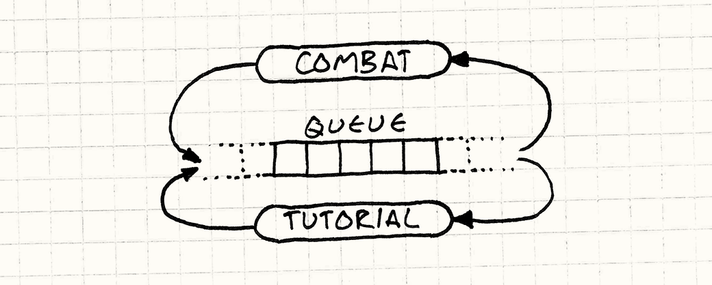
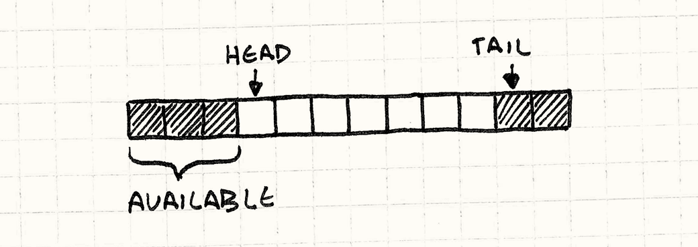

事件队列
============================
##目的

对消息或事件的发送与受理进行时间上的解耦。

##动机

除非你生活在那些少有的几个脱离互联网的地区里，否则你很可能已经对“事件队列”有所耳闻。如果对这个词不熟悉，那么也许“消息队列”，“事件循环”或者“消息泵”能令你想起些什么。为了让你的记忆更清晰，让我们先一起来看看这一模式的两个常见应用吧。

在本章中我将“事件”和“消息”替换着使用，如果需要区分它们我会另外提醒大家。

###用户图形界面的事件循环

如果你曾从事过用户界面编程，那你肯定对事件不陌生了。每当用户与你的程序交互时：比如点击按钮，下拉菜单，或者按下一个键，操作系统都会生成一个事件。系统将这个事件对象抛给你的应用程序，你的任务就是获取到这些事件并将其与对应的自定义行为挂钩。

这种应用程序风格很常见，它被视为一种程序样式：[事件驱动式编程](http://en.wikipedia.org/wiki/Event-driven_programming)。

为了能收到这些事件，在你代码的底层设施中必然有个事件循环。它的大致结构如下：

```c++
while (running){
 Event event = getNextEvent();
 // Handle event...}
```

对`getNextEvent()`的调用为你的应用程序拽来了一大把未经处理的用户输入。你将它导向一个事件句柄，于是你的应用程序魔法般地活了起来。有趣的地方在于应用程序会在它需要时才引入事件，操作系统并不在用户操作外设时就立即跳转入你的程序内部。

类似地，操作系统的中断也是这样运转的。当中断发生时，操作系统终止你应用程序的一切运转，并强制让程序跳转入一个中断处理句柄中。这样粗野的做法也正是中断之所以难处理的缘故。

这意味着当用户的输入到来时，必须要有个位置安置这些输入，以防它们在硬件报告输入时与你的应用程序调用`getNextEvent()`期间被操作系统漏掉。这里所谓的“安置位置”正是一个队列。


当用户输入到来时，操作系统将它添加到一个未处理事件队列中。当你调用`getNextEvent()`时，函数会将最早的事件取出并将它交给你的应用程序。

###中心事件总线

多数游戏的事件驱动机制并非如此，当然一个游戏维护它自身的事件队列作为其神经系统的主心骨这是很常见的。你将常常听到“中心式“，“全局的”，“主要的”这类对它的描述。它被用于那些希望保持模块间低耦合的游戏，起到游戏内部高级通讯模块的作用。

如果你想知道为何他们不是事件驱动的，可以打开[Game Loop](03.2-Game Loop.md)这一章节看看。

假设你的游戏有一个新手教程，在完成指定的游戏内事件后弹出帮助框。例如，玩家首次击败一个蠢怪物，你希望弹出一个小气球框上面写着“按下X以拾取战利品”。

新手教程系统往往是优雅继承设计的硬伤，而且多数玩家仅会在系统帮助上花去极少的时间，于是这看起来吃力不讨好。然而这短暂的引导时间却是将玩家导入你游戏的宝贵机会。

你的游戏玩法以及战斗相关的代码会很复杂。最后你想做的就是往这些复杂的代码里塞入一系列检查以用于触发引导。当然你可以用一个中心事件队列来取而代之。游戏的任何一个系统都可以向它发送事件，于是战斗模块的代码可以在你每次消灭一个敌人后向该队列添加一个“敌人死亡”的事件。

相似地，游戏的任一系统都能从队列中收到事件。新手引导模块向事件队列注册自身，并向其声明该模块希望接收“敌人死亡”事件。借此，敌人死亡的消息可以在战斗系统和新手引导模块不进行直接交互的情况下在两者之间传递。

这个共享空间能够让实体向其发送消息并能收到它的通知，这一模式与AI领域的平[blackboard systems](http://en.wikipedia.org/wiki/Blackboard_system)有相似之处。



我本想将此作为本章后续的一个例子，但实际上我并不对大型全局系统很感兴趣。事件队列所负责的通讯并不一定要横跨整个游戏引擎，它也可以仅在一个类或一定范围内发挥作用。

###说些啥好呢
所以来说说别的，让我们往游戏中加入音乐。人类是强视觉化的动物，而听觉则将我们与自身情感以及对物理空间的知觉深刻地联系在一起。恰当的回音模拟可以让漆黑的屏幕有巨大洞穴的感觉，而一段时机恰当的抒情小提琴旋律会拨动你的心弦令你产生共鸣而随之轻声哼唱。

为了让我们的游戏在音乐方面有突出的表现，我们从最简易的方法入手来看看它是如何运作的。我们将向游戏中添加一个小的“音效引擎”，它包含根据标识和音量来播放音乐的API：

由于我总是回避[单例](02.5-Singleton.md)模式——这是一种可行的方案，好比一台机箱只配一副喇叭那样。我将采取一个更简单的方法：仅仅将方法声明为静态：

```c++
class Audio{public:
 static void playSound(SoundId id, int volume);};
```

这个类要做的是，加载恰当的声音资源，找到可用的声道来提供播放，并开始将它播放出来。本文与具体平台的音效API无关，所以我任意采用一个，你可以假设它适用于任何平台。借此我们的方法可以实现如下：

```c++
void Audio::playSound(SoundId id, int volume){
 ResourceId resource = loadSound(id);
 int channel = findOpenChannel();
 if (channel == -1) return;
 startSound(resource, channel, volume);}
```

我们检查音效，并创建一些声音文件，并在游戏代码种加入少量的`playSound()`调用进行播放，它们就像一些带着魔法的小喇叭。例如在UI代码中，当菜单的选中项改变时我们播放一个小音效：

```c++
class Menu{public:
 void onSelect(int index)
 {
  Audio::playSound(SOUND_BLOOP, VOL_MAX);
  // Other stuff...
 }};
```

在此之后，我们注意到有时切换菜单项时，整个屏幕会卡顿几帧，这便触及了我们的第一个话题：

问题1：在音效引擎完全处理完播放请求前，API的调用一直阻塞着调用者。	

我们的`playSound()`方法是同步执行的：它只有在音效被完全播放出来后才会返回至调用者的代码。假如一个声音文件需要先从磁盘中加载，那么这次调用就要花去一些时间。此时游戏的其他部分便都卡住了。

现在我们暂时不考虑它，继续往下看。在人工智能代码中，我们增加一个调用可以让玩家攻击敌人造成伤害时发出痛苦的哀号声。 没有比模拟生命遭受伤害更能温暖一个玩家的心了。

它会执行，但有时同一帧中，英雄猛烈攻击两个敌人的情况发生。这就引起游戏同时发出两次哀号声。如果你了解一些音效知识，那你就会知道多个声音混合在一起会叠加它们的声波。也就是说，当遇到*相同*的声波时，声音听起来和一个声音一样，但声量会大两倍。


在[亨利海茨沃斯大冒险](http://en.wikipedia.org/wiki/Henry_Hatsworth_in_the_Puzzling_Adventure)游戏中偶然遇到该情况。和我们刚才的解决方案是类似的。

和boss战斗中，有许多小喽啰跑来跑去会引起冲突，也会遇到相关问题。硬件一次只能播放这么多声音。当我们超过那个临界值以后，声音听起来要么没有要么会中断。

为了处理这些问题，我们需要观察整个的声音集合，并加以汇总和区分。不幸的是，我们的声音API 每次单独处理一个`playSound()`函数。看起来像是请求一次一个地穿过针孔。

 *  **问题2：不能一起处理请求**

跟我们遇到的下个问题相比有一点烦恼.目前,代码库中在许多不同的游戏系统中到处调用`playSound()`函数.但是我们的游戏引擎运行在现代多核硬件上面.为了充分利用上多核,我们分配它们在不同的线程中--一个渲染,另一个执行人工智能,等等.

由于我们的API是同步的,会打开*调用者的*线程. 从不同的游戏系统中调用它时,会多线程同步的调用API.看示例代码.看见任何的线程同步了吗?反正我没有看见.

特别惊人的是,我们试图有一个单独的声音线程.当其他的线程互相忙碌和破坏一些事情时,它会一直空闲下去.

 *  **问题3:请求被执行在错误的线程**

这些问题的共同点是声音引擎调用`playSound()`函数的意思是"放下所有事情,马上播放音乐!"*马上处理*就是问题.其他游戏系统在*它们*合适的时候调用`playSound()`函数,而声音引擎不是必须要处理这个需求.为了修复这一情况,我们会在处理*接受*请求中解耦.

## (事件队列)模式

**队列**按照先进先出的顺序存储一串**通知或者请求**.发送一个**请求入列然后返回**通知.请求处理器稍后会**从队列中处理该项目**.
请求会**直接处理掉**或者**转交给对它感兴趣的部分**.**静态**且**及时**的**解耦接受者和发送者**

## 使用情境

如果你只想对*谁*从发送者接受信息解耦,模式类似于[观察者](observer.html)和[命令](command.html),减少复杂性.想要*及时*解耦某事的时候,只需要一个队列即可.

最近的每章节中我都有提到这个模式,但是它是值得强调的.复杂性会让你慢下来,所以遇到简洁的时候会是一个非常宝贵的资源.

按照推拉的方式思考.代码A打算另一个代码块B做一些事情.自然的方式是通过*推*给请求给B来让A初始化.

同时,对B的自然方式是通过在*它们*运行周期中方便的时候*拉*处理请求.当你在一端推此模型和另一端拉此模型,在两者之间需要一个缓冲.这就是队列能提供的简单解耦模型.
队列会控制被拉进来的代码--接受者会延迟处理,集合请求或者全部废除.但是队列把控制权从发送者*撤离*.全部的发送者希望给队列扔一个请求.发送者需要相应的时候,会让队列响应不是很好.

## 使用须知

不像本书中其他更温和的模式,事件队列会更复杂一些和让你对游戏框架有了广泛深远的影响.也就意味着你会弄明白它如何--如果的话--你使用它.

### 中心事件队列是个全局变量

该模式普遍的作用是中央车站,游戏的所有部分可以传递消息.它是游戏中强大的结构,但是*强大*通常不意味着*不错*.

需要花费一些时间,但是我们大部分会认为全局变量是不好的.当你有程序任何部分的状态时,各种各种细小部分不知不觉的互相依赖.模式封装这些状态成为一种不错的饿小协议,但仍然是全局性的,需要伴有危险性.

### 游戏世界的状态任你掌控

当一个虚拟宠物摆脱他的烦恼时,人工智能代码会布置一种"实体死亡"事件给队列.这是事件不知多少帧在队列中闲置,直到最终调到前面得到处理工作起来.

与此同时,经验系统想要记录女英雄身体数量和奖励它可怕的效率.它会收到每个"实体死亡"事件和决定某种的实体死亡,根据杀死难度,来分发合适的奖励.

世界需要不同种类的状态.我们需要实体死亡.所以我们能看见它是多么的粗糙.我们可能想要检查周围,看看附近其他的障碍或宠物.但如果事件到后来没有被接收到,那么物品会消失.实体可能会解除分配,其他附近的敌人也会分散.

当你接受一个事件,你会非常小心不要假设*当前*世界的状态怎样反射的世界是*什么时候事件会发生*.这就意味着队列事件视图比同步系统中的事件更多沉重的数据.稍后,通知会说"某事发生了"和接受者四周看看细节.对于队列,这些细节当事件发送稍后会被用到的必须要捕捉.

### 你会停滞在反馈系统循环

全部的事件和消息系统需要关注以下周期:

 1. A发送一个事件.
 2. B 接收它,之后发送一个响应事件.
 3. 事件发生在A关心的地方,所以接收它.A也会发送一个响应事件...
 5. 见2.

你的消息系统是*同步的*,你会发现周期非常快--它们会栈溢出造成游戏崩溃.对于队列来说,异步的放开栈处理,即使假的事件会前前后后冲击,但游戏会依然运行.一个通常的规律来避免这些避免*发送*事件的代码来*处理*.
在事件系统中使用一个很小的调试日志也会是一个不错的主意.

## 示例

我们已经见到一些代码.不是很完美,但是有基本的正确功能-- 有我们想要的公用API和正确的低级别声音调用.现在剩下我们做的事情就是要修复这些问题.

首先我们的API会*阻塞*.当一段代码播放声音时,不可以做任何事情,直到`playSound()`函数加载完资源后,实际上会让扬声器响动.

我们想推迟工作这样`playSound()`可以快速返回.为了做到这些,我们需要*具体化*需求来播放声音.我们需要一些结构来存储等待期间的请求.这样稍后可以让他们保持活动.

```c++
struct PlayMessage
{
  SoundId id;
  int volume;
};
```

接下来,我们需要给`音频`一些空间好让它可以追踪这些播放的消息.现在,你的算法老师可能会告诉你用一些令人兴奋的数据结构.比如[斐波那契](http://en.wikipedia.org/wiki/Fibonacci_heap)或者[跳跃列表](http://en.wikipedia.org/wiki/Skip_list).实在不行,至少*链表*也行.但实践中,存储一群同类视图,最佳方式是,几乎通常的做法是简单的数组:

<aside name="prof">

Algorithm researchers get paid to publish analyses of novel data structures.
They aren't exactly incentivized to stick to the basics.


 *  无动态分配.

 *  没有为记录信息的存储开销或指针.

 *  可缓存的连续存储空间.

关于"可缓存"的更多信息,查看[数据局部性](06.1-Data Locality.md)章节


我们这样做:

```c++
class Audio
{
public:
  static void init()
  {
    numPending_ = 0;
  }

  // Other stuff...
private:
  static const int MAX_PENDING = 16;

  static PlayMessage pending_[MAX_PENDING];
  static int numPending_;
};
```

调节数组的大小来覆盖我们最坏情况.为了播放声音,我们简单的在结束的位置放置一个新的消息:

```c++
void Audio::playSound(SoundId id, int volume)
{
  assert(numPending_ < MAX_PENDING);

  pending_[numPending_].id = id;
  pending_[numPending_].volume = volume;
  numPending_++;
}
```

让 `playSound()`函数几乎马上返回,但仍然需要播放音乐,当然,这段代码需要在某处运行,而且是一个`update()`方法:

```c++
class Audio
{
public:
  static void update()
  {
    for (int i = 0; i < numPending_; i++)
    {
      ResourceId resource = loadSound(pending_[i].id);
      int channel = findOpenChannel();
      if (channel == -1) return;
      startSound(resource, channel, pending_[i].volume);
    }

    numPending_ = 0;
  }

  // Other stuff...
};
```

正如名字表明的一样,这是[更新方法](03.3-Update Method.md)模式

现在,我们需要在某处适时的调用它,*适时*意味着它依赖游戏.它在主要的[游戏循环](game-loop.html)或者一个专用的声音线程调用.

它运行的很好,但很难推测可以单独调用`update()`函数,执行*每一个*声音请求. 如果你做一些类似于声音资源加载后,异步处理请求的事情,它就不会运行.对于`update()`函数一次运行在一个请求上,它需要从剩下的缓冲区中拉出请求.换句话说,我们需要一个真实的队列.

### 环状缓冲区

有很多方法可以实现队列,但我最喜欢的是*环状缓冲区*它用数组来保存所有的事情.可以让我们对前面的队列递增的移动元素.

现在,我知道你在想什么.如果我们从数组的开始移动元素,难道不会移动剩下所有的元素吗?不会很慢吗?

这是为什么让我们学习链表的原因-- 你可以移动节点,但没有移动周围的任何元素.很好,这表明你可以在数组中实现一个队列也没有移动周围的任何元素.我会带你了解它,但首先让我们明确一些术语:

 *  队列的**头部**是请求*读取*的地方.头部中存储的是最老的请求. 

 *  队列的**尾巴**是另一端. 是下一个排队请求*写入*的位置.注意仅仅是*越过*队列的结束.如果有帮助的话,你可以认为它相当于一个半开的范围.

由于`playSound()`会在数组的结束追加新的需求,头部下标以0开始, 向右增长.


让代码来展示.首先,我们在类中清楚地声明字段,两个清楚的标志:

```c++
class Audio
{
public:
  static void init()
  {
    head_ = 0;
    tail_ = 0;
  }

  // Methods...
private:
  static int head_;
  static int tail_;

  // Array...
};
```

在`playSound()`函数实现中, `numPending_` 被替换成 `tail_`, 其他地方是一样的:

```c++
void Audio::playSound(SoundId id, int volume)
{
  assert(tail_ < MAX_PENDING);

  // Add to the end of the list.
  pending_[tail_].id = id;
  pending_[tail_].volume = volume;
  tail_++;
}
```

更有趣的变化在 `update()`函数:

```c++
void Audio::update()
{
  // If there are no pending requests, do nothing.
  if (head_ == tail_) return;

  ResourceId resource = loadSound(pending_[head_].id);
  int channel = findOpenChannel();
  if (channel == -1) return;
  startSound(resource, channel, pending_[head_].volume);

  head_++;
}
```

我们会处理队列头部，通过移动头指针来废弃它。通过观察头到尾部是否有任何距离来检测空序列。

这就是为什么我们让尾巴*经过*最后一项。如果头和尾拥有相同的索引，意味着队列就是空的。

现在我们的有了一个队列--我们可以从尾部增加元素然后从头部移除。那么有一个明显的问题。当我们通过队列运行请求时，头部和尾部慢慢向右边移动。最终，`tail_`到达数组的最后，然后派对时间就结束了。这就是聪明的地方。

你想要派对时间结束吗?不，你不想。



注意尾部一直向前移动，*头部*也是。这就意味着得到的数组*开始*元素就不能再使用了。当移动到最后我们要做的就是把尾部到绕回到头部。这就是为什么叫做*环状*缓冲区--它扮演类似一个圆形细胞阵列。


实现它是非常容易。当我们入列一个项目，仅需要确认到达底部时绕回到数组的开始：

```c++
void Audio::playSound(SoundId id, int volume)
{
  assert((tail_ + 1) % MAX_PENDING != head_);

  // Add to the end of the list.
  pending_[tail_].id = id;
  pending_[tail_].volume = volume;
  tail_ = (tail_ + 1) % MAX_PENDING;
}
```

用增量模数组的数组大小，尾部绕回来代替`tail_++`。其他改变的额地方时断言。我们需要保证队列不能溢出。一旦出现大于`MAX_PENDING`队列请求时，就会出现头部到位之间的未使用单元的间隙。如果队列填补进来，那它就会消失。像一些奇怪的倒退毒蛇,尾巴会和头部冲突进而开始覆盖掉它。声明保证了该情况不会发生。

在`update()`函数中,我们同样对头部做了封装:

```c++
void Audio::update()
{
  // If there are no pending requests, do nothing.
  if (head_ == tail_) return;

  ResourceId resource = loadSound(pending_[head_].id);
  int channel = findOpenChannel();
  if (channel == -1) return;
  startSound(resource, channel, pending_[head_].volume);

  head_ = (head_ + 1) % MAX_PENDING;
}
```

这下你应该懂了--一个队列是没有动态分配，没有向周围拷贝元素，可缓存性的一个简单数组。

如果最大容量会有问题，你可以使用可增长的数组。当队列满了以后，分配一个新的数组，大小是当前数组的二倍（或其他的倍数），之后把剩下的项目拷贝过去。

即使在数组增长的时候拷贝，入列一个元素仍然有常数*均摊*的复杂性。

### 汇总请求

现在我们已经有了一个队列, 可以移到其他的问题上。第一个是多个请求要播放相同的音乐会很大声。原因我们知道，请求正等待着处理，我们需要做的是如果匹配到一个已经等待的请求，就合并它：

```c++
void Audio::playSound(SoundId id, int volume)
{
  // Walk the pending requests.
  for (int i = head_; i != tail_;
       i = (i + 1) % MAX_PENDING)
  {
    if (pending_[i].id == id)
    {
      // Use the larger of the two volumes.
      pending_[i].volume = max(volume, pending_[i].volume);

      // Don't need to enqueue.
      return;
    }
  }

  // Previous code...
}
```
当我们得到两个请求播放相同的音乐时，拆散他们为一个单独的请求,按两者中声音最大为准。“汇总”是相当初步的，但我们可以用同样的想法批量处理做更多有趣的事情。

注意当请求*入列*时才合并它，而不是*处理*时。对于队列来说简单的多，因为不会浪费在多余的请求上，而导致稍后的崩溃结束。非常简单的实现它。

地确很容易实现，但是，会给调用者增加处理负担。调用`playSound()`返回之前会遍历全部的队列，一旦队列非常大，就会很慢。可能使用`update()`函数汇总请求会更有意义。

另一种避免*O(n)* 扫描成本的方式是用一个不同的数据结构，如果我们对`SoundId`使用哈希表，之后就可以快速检查重复。

这里有一些重要的事情要记住。我们可以汇总“同步发生”的窗口请求只和队列一般大小。如果我们更快的处理请求，队列尺寸保持很小，那么我们有较少的机会可以一起批量处理请求。同样，如果处理请求滞后，队列充满，我们将会发现更多的崩溃事情。

这种模式从知道何时会处理请求时，隔离请求。但是当你把整个队列作为一个动态的数据结构去操作时，提出请求和处理请求之间会发生滞后。它可以明显影响行为。所以，确认这么做之前你做好了准备。

### 跨越线程

最后，最严重的问题。出现在同步音频API，无论什么线程调用`playSound()`函数，线程就会处理该请求。这通常不是我们想要的。

在今天的多核硬件时代,如果你想最大利用你的芯片，需要不止一个线程。有无穷种方式可以分发代码跨越线程，但是一个普遍的策略是在它自己的线程移动游戏的各个领域--声音，渲染，人工智能等等。


一行代码一次只能运行在单核上面。如果你不使用线程，即使你用正时兴的异步编程，这是发挥CPU的能力的一小部分。最好的你做的是保持一个单核忙碌。

服务器程序员通过把他们的应用程序分解为多个独立的*进程*来弥补单核忙碌忙碌的情况。这就让操作系统可以同步运行在不同的核上。游戏大部分通常是单进程，所以使用一些线程真的会有帮助。

良好的情形下，现在我们有三个关键部分:

 1. 请求声音的代码可以和播放声音解耦。
 2. 两者之间有一个队列来封送处理。
 3. 队列封装程序的其余部分。

所有剩下做的事情是修改队列`playSound()`函数和`update()`函数--线程安全。一般，我会用一些具体的代码来实现，但由于这是一本关于框架的书，所以我不打算陷入 　　任何特定的API或锁定机制的细节。

站在高级别来看，所有我们需要做的是要保证队列不被同步修改。因为`playSound()`函数做非常小量的工作--基本上分配一些字段--可以锁它，也不长时间的阻塞处理。在`update()`函数中，我们等待条件变量所以我们不消耗CPU周期,直到有一个请求处理。

## 设计决策

许多游戏使用事件队列作为沟通的一个关键部分的结构，你可以花大量的时间来设计各种复杂的路由和过滤消息。建立类似于洛杉矶电话交换机，但在你进行之前，我鼓励你简单开始。这里有几个起初思考的问题：

### 什么会在队列中?

迄今为止，“事件”和“消息”总是替换着使用，它主要是没关系。队列中你填塞什么，都会得到相同的解耦和汇总能力，但仍然有一些概念上的不同。

 *  **如果队列中是事件:**

    一个“事件”或“通知描述*已经*发生的事情。你排队，其他对象可以*响应*事件”，有几分像一个异步的[观察者](02.3-Observer.md)模式。
    
     *  *你可能会允许多个监听器.* 由于队列包含的事件已经发生，发送者不关心谁会接收到它。从这个角度来看,这个事件在过去已经被忘记了。

     *  *队列往往有更广的边界* 。事件队列经常用于给任何和所有感兴趣部分*广播*事件。为了允许感兴趣的部分有最大的灵活性，这些队列往往有更多的全局可见性。

 *  **如果队列中是消息:**

一个“消息”或“请求”描述一种*想要*发生在*将来*的行为，类似于“播放音乐”。你可以认为这是的一个异步API服务。

 另一种关于“请求”是“命令”的表达在[命令模式](02.1-Command.md) 中，也可以使用队列。

   *  *你更可能有个单一的监听器。* 示例中,消息排队专门为*音频API *播放声音请求。如果其他游戏的随机部分开始从队列中偷窃消息，它不会工作的很好。


我说过它们“更相似”，是因为你可以入列消息，只要期望它*如何*处理，而不关心哪些代码会处理它。这种情况下，你做的事情类似于[服务定位器](05.3-Service Locator.md)。

### 谁能从队列读取?

在我们的示例中，队列被封装和只有`Audio`类可以读取它。用户接口的事件系统中，你可以尽情的注册监听器。有时会得知*单播*和*广播*去分发这些，所有的方式都是有用的。

 *  **一个单播队列:**

    当一个队列是一个类的API本身的一部分时。类似我们的声音示例，站在调用者的角度，他们只能看见 `playSound()`方法能调用。
     *  *队列成为阅读器的实现细节* 所有的发送者知道是它发送了一条消息。
     *  *队列是封装的* 所有其他条件相同的情况下,更多的封装通常是更好的。

     *  *你不必担心和多个监听器的竞争情况*，你不得不决定他们是否*全部*得到每一项（广播）或者是否*每一个*队列中的项 分配给*一个*监听器（更像一个工作队列）

       在其他情况，监听器可能会做重复的工作或者互相干扰，所以必须仔细思考你想要做的。对于一个单一的监听器，这种复杂性会消失

 *  **广播队列:**

    这是大多数“事件”系统的做的事情。当一个事件进来时，如果你有十个监听器，它们都能看见该事件。
     *  *事件可以被删除* 先前观点的推论是如果你有*零个*监听器，所有都会看见事件。在大多数的广播系统中，如果某一时刻处理事件没有监听器，事件就会被废弃。

     *  *可能需要过滤事件* 播放队列通常是广泛的可见的程序,你可以关闭一些监听器。多事件需要多个监听器,结束大量的事件处理程序调用。

        为了缩减规模，大部分广播事件系统会让一个监听器过滤他们收到的事件集合。例如，它们会说他们想要接受鼠标事件或者用户界面一定区域内的UI事件。

 *  **工作队列:**

   类似于一个广播队列，此时你也有多个监听器。不同的是队列中的每一项只能得到*一个*。这是一种常见，分配的工作模式额，并发运行的线程池。

     *  *你必须安排.* 因为一个项目只有一个监听器，队列逻辑需要找出最好的选择。这可能是简单循环或随机选择，或者是一些更复杂的优先级系统。

### 谁可以写入队列?

这是以前设计选择的另一面。该模式适用于所有可能的读/写配置：一对一，一对多，多对一，多对多。

你有时会听说用于描述多对一的“输入端”通信系统和用于描述一对多的“输出端”通信系统。

 *  **一个写入者:**

    这种风格是最类似于同步[观察者](observer.html)模式。你有一个特权对象可以接收对象,生成事件。

    *  *你心里知道事件来自哪里* 因为只有一个对象可以增加到队列，任何监听器可以安全地假设是发送者。

    *  *通常允许多个读取者* 你有一个发送一个接收的队列，但是,开始觉得这一模式不太像通信系统，更像是一个香草队列数据结构。

 *  **多个写入者：**

    这是我们的音频引擎如何工作的的例子。因为`playSound()`函数是一个公共方法，任何代码库部分都可以添加一个请求给队列。“全局”或“集中”事件总线也是这样工作。

    *  *你必须小心周期* 因为任何东西都可能放到队列中，处理时间期间很容易突然入列一些东西。如果你不小心，可能会出发反馈循环。

    *  *你可能会想要一些发送方在事件本身的引用*。当监听器得到一个事件，它不知道是谁发送的，因为它可能是任何人。如果这是他们需要知道的，你要打包进事件对象,监听器就可以使用它了。

### 队列中对象的生命周期是什么?

周期有一种同步的通知，执行不会返回给发送者，直到所有的消息处理完毕。这就意味着消息本身可以安全的存在栈中的本地变量中。对于一个队列，消息入列后仍然可以调用它。

如果你使用一个垃圾回收机制的语言，你不需要过多担心这个。填满队列中的消息，只要是必要的时候就会逗留在内存里。C或者C++中，它取决于你保证对象存活时间足够的长。

 *  **转移所有权：**

  手动管理内存，这是一种传统的方法。当一个消息排队时，队列发出声称，发送者不再拥有它。当消息处理时，接收者取走所有权并负责释放它。

> C++中，`unique_ptr<T>` 解释了非常确切的语义。

 *  **分享所有权：**

  目前即使C++程序员适合垃圾回收，但分享所有权会更容易接受。这样一来，只要任何事情对它有一个引用，消息就会逗留。当被忘记时就会自动释放。

> 同样地，C++类型中针对分享所有权的是`shared_ptr<T>`.

 *  **队列拥有它:**

  另一个观点是消息*总是*存在队列中。不用自己释放消息，发送者会从队列中请求一个*新的*消息。队列返回一个已经存在于队列内存的消息引用，接着发送者会填充它。消息处理时，接收者参考队列中相同消息的操作。

> 换句话说,支持该存储队列的是一个[对象池](object-pool.html)。


## 参考

 *  我已经提到事件队列许多次了，但在很多方面，这个模式可以看成是著名的[观察者](02.3-Observer.md)模式的异步姊妹。

 *  和很多模式一样，事件队列有过一系列的术语。刚创建时期叫做“消息队列”。通常在更高层次的表现会提到。当事件队列*用于*一个应用程序时，消息队列总是用于消息*之间*的通信。

    另一个术语是“发布/订阅”，有时缩写为“订阅”。类似于“消息队列”，它总是在大型分布式系统中提及，而不专用于简陋的编码模式中。

 *  一个[有限状态机](http://en.wikipedia.org/wiki/Finite-state_machine),类似于四人帮的 [状态](state.html)模式,需要一个输入流。如果你想要异步地响应它们，把他们入列就好。

    当你有一堆状态机互相发送消息的时候，每个都有一个小的队列等待输入(称为*邮箱*)，之后你重新发明了计算[角色模式](http://en.wikipedia.org/wiki/Actor_model)。

 *  [Go](http://golang.org/)编程语言内置“通道”类型，本质上是一个事件或消息队列。