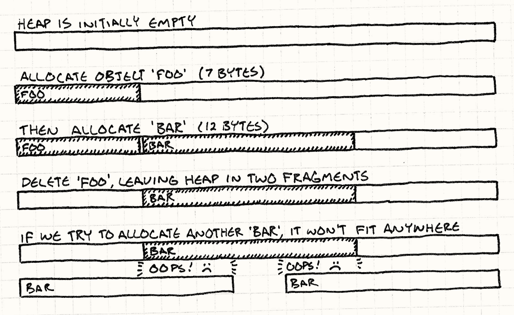

对象池
============================

# 目的

使用固定池重用对象，取代手动分配，释放对象，以此来达到提升性能和内存使用的目的

# 动机

我们正致力于我们游戏的视觉效果优化。当一个英雄施放魔法时，我们想让一个闪烁的火花在屏幕中崩裂。这一特效将调用粒子系统——一个用来生成微小发光图形并在它们生存周期内产生动画的引擎。

由于光是一个魔棒就会引发数以百计的粒子生成，故我们的系统需要快速地生成它们。更重要的是，我们需要确保创建和销毁它们时不会带来_内存碎片_。

<!-- By ChildhoodAndy -->
<!-- a single wave of the wand 魔棒一个单一的挥动 -->

## 碎片化的害处

控制台和移动设备游戏编程从多方面而言都比传统的PC编程要更接近于嵌入式编程。就像嵌入式编程一样，控制台游戏必须在很长的一段时间内运行而不能有崩溃或是内存泄露的情况，而且多数情况下无法使用高效的内存压缩管理器。在这样的情况下内存碎片是致命的。

碎片化意味着我们空闲着的堆空间被破坏成了许多小的内存碎屑，而不是一整块连续的内存块。或许这些小碎屑构成的可访问内存总量是很大的，但其中最连续的区域却可能小得可怜。假如我们有14字节的空闲内存，但它被一个已使用内存分割为了两个7字节的片段——假如这时我们想分配一个12字节的对象，则会失败，屏幕上也不会出现任何闪光画面了。

> 注解

> 碎片化：这就像在一条杂乱散布着车辆的热闹街区里尝试停车一样，如果他们首尾紧挨着，那么就能腾得出空间，但在乱停放的情况下这些空间却只是众车辆之间的碎片空间。



上图解释了一个堆如何变得碎片化，以及这是如何导致内存分配失败(尽管在理论上有足够的空间供其分配)。
就算碎片化的情况很少，它仍然在削减着堆并使其成为一个千疮百孔而不可用的泡沫块，严重局限了整个游戏的表现力。

> 注解 

> 浸泡测试: 许多控制台游戏制作者都要求游戏通过“浸泡测试”（soak tests）——他们将游戏置于 demo 模式连续地跑上好几天。假如游戏崩溃了，他们则不会让游戏投入市场。尽管浸泡测试的失败有时会来自极罕见的意外 bug，但多数情况下碎片化的扩张或者是内存泄露才是导致游戏当机的原因。


## 二者兼顾

由于碎片化，以及内存分配缓慢的缘故，在游戏中何时以及如何管理内存需要十分谨慎。一个常用而有效的办法是：在游戏启动时分配一大块内存，直到游戏结束才释放它。但当我们在游戏运行过程中创建或销毁东西时，这一方法会成为系统的硬伤。

使用对象池使得我们二者兼顾：对于内存管理器而言，我们仅分配一大块内存直到游戏结束才释放它，对于内存池的使用者而言，我们可以按照自己的意愿来分配和释放对象。

# 对象池模式

定义一个保持着**可重用**对象集合的**对象池**类。其中的每个对象支持对其**”使用中”**(“in use”)状态的**访问**，以确定这一对象目前是否“存活”(“alive”)。当对象池初始化时，它预先创建整个对象的集合(通常为一块连续堆区域)，并将它们都置为”未使用” (“not in use”) 状态。

当你想要创建一个新对象时就向对象池请求。它将搜索到一个可用的对象，将其初始化为”使用中”(“in use”)状态并返回给你。当该对象不再被使用时，它将被置回”未使用” (“not in use”) 状态。使用该方法，对象便可以在无需进行内存(或其他资源的)分配的情况下进行任意的创建和销毁。

# 使用情境

这一设计模式被广泛地应用在游戏中，如游戏实体对象，各种视觉特效，甚至是非可视化的数据结构，如当前播放的声音。我们在以下情况使用对象池：

-  当你需要频繁地创建和销毁对象时。
-  对象的大小一致时。
-  在堆上进行对象内存分配较慢或者会产生内存碎片时。
-  每个对象包含着较昂贵且可重用的资源(如数据库，网络的连接)时。

# 使用须知

你一般依赖于一个垃圾回收器或只是简单地`new`和`delete`来为项目进行内存管理。而通过使用对象池，你就是在告诉系统：“我更明白这些字节应该如何处理。”也就意味这个模式的规则是完全由你来负责制定的。

## 对象池可能在闲置的对象上浪费内存

对象池的大小需要根据游戏的需求量身定制。在确定大小时，分配过小的情况往往很明显(任何一个崩溃都能告诉你这一点)，但要同时注意不能让池子过大。一个大小适中的池可以腾出空余的内存来供其它模块使用。

## 任意时刻处于”使用中”状态的对象数目恒定

从某些角度上说这是件好事。将内存划分为几个独立的对象池用于不同类型的对象管理，这一点保证诸如下面的这些情况不会发生：例如，一大连串的爆炸动画不会致使你的粒子系统把所有的可有内存全部占用，也能避免创建敌人时的类似情况。

然而，这也意味着你要为如下情况做好准备：当你希望向对象池申请重用某个对象时，可能会失败，因为它们都在被使用。以下是一些针对此问题的常见对策：

-  _彻底根除。_这也是最常见的方法：约束对象池的大小令其不论使用者如何分配都不会致使溢出。对于重要的对象池，如怪物或游戏道具池，这往往是行之有效的。并没有什么所谓正确的方法来处理当玩家到达关卡尾部时没有任何空闲的空间来创建”大Boss”这样的情况，所以最聪明的办法还是从根本上避免其发生。
	
	上述方法的负面是，它会令你仅仅为了十分罕见的边际情况而腾出许多空闲的对象空间。鉴于此，单一的固定大小的对象池并不适用于所有的游戏状态。例如，有些关卡显著偏重于特效而另一些则偏重于音效。在此情况下，可以考虑针对不同的场景将池调整至不同尺寸。
-  _不创建对象。_这听起来很残忍，但它在诸如粒子系统中十分奏效。假如所有的粒子对象都处于使用状态，那么屏幕将可能被闪光的图元所覆盖。玩家将不会注意到下一次的爆炸效果是否和当前的效果是否一样炫。
-  _强行清理现存对象。_以一个音效对象池为例，并假设你想要播放新的一段音效但对象池满了。你并不希望直接忽视掉这个新的音效:玩家会注意到他们的魔杖在施法时有时带着咒语而有时却不听话地沉默了。解决方案是，检索当前播放的音效中最不引人注意的并以我们的新音效替换之。新的音效将掩盖旧音效的中断。

	一般来说，如果新对象的出现能让我们无法觉察到既有对象的消失，那么清理现存对象的方法会是一个好选择。
-  _增加对象池的大小。_假如游戏允许你调配更多的内存，你可以在运行时对对象池扩容，或者增设一个二级的溢出池。假如你通过上述任一种方法获取到更多内存，那么当这些额外空间不再被占用时你就必须考虑是否将池的大小恢复到扩容之前。


## 每个对象的内存大小是固定的

多数对象池在实现时将对象原地存入一个数组中。假如你的所有的对象都属于同一类型，没问题。然而假如你希望在池中存入不同类型的对象，或者子类型(带有额外的类成员)，那么你就必须保证对象池中的每个槽都能容纳这些类型中尺寸最大者。否则一个未知的大对象将占去相邻对象的空间，并导致内存崩溃。

与此同时，当你的对象大小不一时，将浪费内存——因为每个对象槽的大小都被要求容得下尺寸最大的那个。假如多数对象的尺寸不那么大，那么每当你置入一个小对象时就在浪费内存。就像你在机场为自己的钱包拉了个大托运一样。

当你发现自己像这样浪费掉许多内存时，考虑根据对象的尺寸将一个池划分为多个——大的装行李，小的装口袋里的杂物。

> 注解 

> 多个对象池: 这是一个实现内存高效利用的通用设计模式。管理器持有许多块尺寸不同的池。当你向它们申请一块时，管理器将从池里挑选合适大小的块并返回给你。

## 重用对象不会被自动清理

多数内存管理器都有一个排错特性：它们会将刚分配或者刚释放的内存置成某些特定值(比如0xdeadbeef)，这一做法将帮助你找到那些由”未初始化的变量”或者”使用了已释放的内存块”引发的致命错误。

由于我们的对象池并不通过内存管理器来重用对象，故我们将脱离这张安全网。更可怕的是，这些”新”对象使用的内存先前存储着另一个同类型的对象。这将使你几乎无法分辨自己是否在创建对象时已将它们初始化——这块存储新对象的内存可能在其先前的生命周期中已经包含了完全相同的数据。

鉴于此，需要特别注意在对象池中初始化对象的部分要对新创建的对象完整地初始化。甚至值得花些功夫为在为清理对象槽内存时增设一个排错功能。

> 注解 

> 推荐清空后将其内存值置为 0x1deadb0b

## 未使用的对象将占用内存
对象池在那些支持垃圾回收机制的系统中较少被使用，因为内存管理器通常会替你进行内存碎片处理。当然对象池在节省分配和释放时开销方面依然有所作为，在 CPU 处理速度较慢且回收机制叫简单的移动平台上尤为如此。

假如你使用了对象池，请注意一个潜在的矛盾：由于对象池在对象不再被使用时并不真正地释放它们，故它们仍占用内存。假如它们包含了指向其他对象的引用，这也将阻碍回收机制对它们进行释放。为避免这些问题，当对象池中的对象不再被需要时，应当清空它指向其他任何对象的引用。

# 示例

模拟现实的粒子系统常常会应用到重力，风力，摩擦力以及其他物理效果。在简化的示例中，我们只是在几帧的时间内将粒子沿着直线移动一些距离，并在结束后销毁它们。虽不比标准的电影水准，但足以为我们展示对象池的应用。

让我们从最简单的实现开始，首先是粒子类：

```c++
class Particle
{
public:
  Particle()
  : framesLeft_(0)
  {}

  void init(double x, double y,
            double xVel, double yVel, int lifetime)
  {
    x_ = x; y_ = y;
    xVel_ = xVel; yVel_ = yVel;
    framesLeft_ = lifetime;
  }

  void animate()
  {
    if (!inUse()) return;

    framesLeft_--;
    x_ += xVel_;
    y_ += yVel_;
  }

  bool inUse() const { return framesLeft_ > 0; }

private:
  int framesLeft_;
  double x_, y_;
  double xVel_, yVel_;
};
```

默认构造函数将粒子初始化为”未使用”状态。(“not in use”)，接下来调用`init()`将其状态置为”使用中”。
粒子随着时间播放动画，并逐帧调用函数animate()。

对象池需要知道哪些粒子可被重用——通过粒子实例的`inUse()`方法来获取粒子的状态。它利用粒子的生命周期有限这一点，同时我们使用变量`_framesLeft`来检查哪些粒子正在被使用(而不是使用一个分隔标志)。
对象池类也很简单：

```c++
class ParticlePool
{
public:
  void create(double x, double y,
              double xVel, double yVel, int lifetime);

  void animate()
  {
    for (int i = 0; i < POOL_SIZE; i++)
    {
      particles_[i].animate();
    }
  }

private:
  static const int POOL_SIZE = 100;
  Particle particles_[POOL_SIZE];
};
```

`create()`函数使用内部代码创建粒子群。游戏逐帧调用对象池的`animate()`方法，它遍历池中所有粒子并调用它们的`animate()`函数。

> 注解 

> 这里的`animate()`方法是 [更新方法](03.3-Update Method.md) 设计模式的一个例子。

对象池简单地使用一个固定大小的数组来存储粒子。在本例的实现中，这个数组的大小在其类声明中被硬编码地写死，当然也可以通过根据给定的大小使用动态数组，或者使用值模板参数来定义。
创建粒子是直接明了的：

```c++
void ParticlePool::create(double x, double y,
                          double xVel, double yVel,
                          int lifetime)
{
  // Find an available particle.
  for (int i = 0; i < POOL_SIZE; i++)
  {
    if (!particles_[i].inUse())
    {
      particles_[i].init(x, y, xVel, yVel, lifetime);
      return;
    }
  }
}
```
我们通过遍历池来寻找首个可用(闲置)的粒子。一旦找到，我们将它初始化并立即返回。注意在这个版本的实现中，假如没有找到可用的粒子，我们就不再创建新粒子。

以上全部就是一个简单的粒子系统，当然不包括粒子的渲染啦~。我们现在可以创建一个粒子池，并通过它创建一些粒子。当粒子的生命周期结束时它们会自动地将自己反激活。

这已经足以在游戏中使用，但细心的读者会发现，创建一个新粒子需要在池内部遍历粒子数组直到找到一个空槽。假设这个池数组很大且几乎已满，此时创建粒子将会十分缓慢。让我们来看看如何由此提升性能：

> 注解

> 时间开销:创建一个粒子的时间开销为O(n),上过算法课的你一定还记得时间复杂度吧。

## 空闲表

假设我们不花时间去检索空闲的粒子槽，那么显然我们得跟踪它们。我们可以单独维护一个指向每个未被使用粒子的指针列表。此时，当我们需要创建粒子时，我们只需移除这个列表的第一项并将这第一项指针指向的粒子进行重用即可。

不幸的是，这可能要求我们管理如同整个对象池对象数组一样庞大的指针列表。毕竟，当我们首次创建对象池时，所有的粒子都是未被使用的，也就是说此时这个列表包含了指向对象池中每个粒子的指针。

假如能不牺牲任何内存来修补我们的性能问题那就太好了。方便的是，我们身边就有一些可利用的资源：正是那些未被利用的粒子它们自己。

当某个粒子未被使用时，它们中的绝大多数是状态异常的，它们的位置和速度都未被使用。它唯一需要的就是用于表示自身是否被销毁的状态，也就是我们的例子中的framesLeft 成员。除此之外的其他空间都是可利用的，修改后的例子如下：

```c++
class Particle
{
public:
  // ...

  Particle* getNext() const { return state_.next; }
  void setNext(Particle* next) { state_.next = next; }

private:
  int framesLeft_;

  union
  {
    // State when it's in use.
    struct
    {
      double x, y;
      double xVel, yVel;
    } live;

    // State when it's available.
    Particle* next;
  } state_;
};
```

例子如下：我们将除了`framesLeft_`之外的成员变量置入一个`live`结构体中，并将它置入一个`state_`联合体中。该结构包括了粒子在播放动画时的状态。当粒子未被使用时(也就是联和结构的其他情况下)，成员`next`将被激活。该成员存储了一指向下其一个可用粒子的指针。

> 注解 

> 联合体union: 在联和体似乎并不那么常用的今天，这个符号可能对你而言有些陌生。假如你在一个游戏团队工作，你可能会成为一个“内存问题专家”：也就是个当游戏不可避免地遇上内存吃紧问题时忙着想办法的受难同胞。想想联合体吧，说到节省字节的办法它们可谓了如指掌。

我们可以利用这些指针(`next`成员)来创建一个对象池中未被使用的粒子列表。我们持有所需的可用粒子列表，且无需额外的内存——我们将那些已死亡粒子占用的空间划分过来以存储这个列表。

这机智的技术被称作空闲表(free list)，为使其正常运作，我们需要保证指针的正确初始化以及粒子在被创建和销毁时能够保持住它们。当然，我们也需要时刻跟踪这个列表的头指针：

```c++
class ParticlePool
{
  // ...
private:
  Particle* firstAvailable_;
};
```

当对象池首次被创建时，所有的粒子处于可用状态，故我们的空闲表贯穿了整个对象池。对象池的构造函数如下：

```c++
ParticlePool::ParticlePool()
{
  // The first one is available.
  firstAvailable_ = &particles_[0];

  // Each particle points to the next.
  for (int i = 0; i < POOL_SIZE - 1; i++)
  {
    particles_[i].setNext(&particles_[i + 1]);
  }

  // The last one terminates the list.
  particles_[POOL_SIZE - 1].setNext(NULL);
}
```

现在创建一个新粒子时我们跳转到第一个空闲的粒子：

> 注解 

> O(1)复杂度，宝贝！万事顺利！

```c++
void ParticlePool::create(double x, double y,
                          double xVel, double yVel,
                          int lifetime)
{
  // Make sure the pool isn't full.
  assert(firstAvailable_ != NULL);

  // Remove it from the available list.
  Particle* newParticle = firstAvailable_;
  firstAvailable_ = newParticle->getNext();

  newParticle->init(x, y, xVel, yVel, lifetime);
}
```

我们需要获知粒子何时死亡以将它置回空闲表中。于是我们将粒子类中的`animate()`改为当这个存活的粒子在某一帧死掉时函数返回`true`。

```c++
bool Particle::animate()
{
  if (!inUse()) return false;

  framesLeft_--;
  x_ += xVel_;
  y_ += yVel_;

  return framesLeft_ == 0;
}
```

一帧死掉此时，我们就把这个粒子串回空闲表：

```c++
void ParticlePool::animate()
{
  for (int i = 0; i < POOL_SIZE; i++)
  {
    if (particles_[i].animate())
    {
      // Add this particle to the front of the list.
      particles_[i].setNext(firstAvailable_);
      firstAvailable_ = &particles_[i];
    }
  }
}
```

这就是了，一个漂亮的，在创建和删除时具有常量时间开销的小对象池。

# 设计决策

如你所见，最简单的对象池实现几乎没什么特别的：创建一个对象数组并在它们被需要时重新初始化。实际项目中的代码可不会这么简单。还有许多扩展对象池的方法，来使其更加通用，安全，便于管理。当你在自己的游戏中使用对象池时，你需要回答以下问题：

## 对象是否被加入对象池?
当你在编写一个对象池时首先要问的一个问题就是这些对象自身是否能知道自己处于一个对象池中。多数时间它们是知道的，但你不需要在一个可以存储任意对象的通用对象池类中做这项工作。

-  __假如对象被加入对象池：__
  
  -  实现很简单，你可以简单地为那些池中的对象增加一个”使用中”的标志或者函数，这就能解决问题了。

  -  你可以保证对象只能通过对象池创建。在 C++ 中，只需简单地将对象池类作为对象类的友元类，并将对象的构造函数私有化即可：

    ```c++
    class Particle
    {
      friend class ParticlePool;

    private:
      Particle()
      : inUse_(false)
      {}

      bool inUse_;
    };

    class ParticlePool
    {
      Particle pool_[100];
    };
    ```

	上述代码中表述的关系指出了使用该对象类的方法(只能通过对象池创建对象)，确保了开发者不会创建出脱离对象池管理的对象。

  -  你可以避免存储一个”使用中”标志，许多对象已经维护了可以表示自身是否仍然存活的状态。例如，粒子可以通过”位置已离开屏幕范围”来表示自身可被重用。假如对象类知道自己可能被对象池使用，它可以提供inUse()方法来检查这一状态。这避免了对象池使用额外的空间来存储那些”使用中”标志。

-  __假如对象不被加入池中：__

  -  任意类型的对象可以被置入池中。这是个巨大的优点。通过对象与对象池的解绑，你将能够实现一个通用，可重用的对象池类。

  -  “使用中”状态可能会在对象外部被追踪。最简单的做法是在对象池中额外创建一块独立的空间：

    ```c++
    template <class TObject>
    class GenericPool
    {
    private:
      static const int POOL_SIZE = 100;

      TObject pool_[POOL_SIZE];
      bool    inUse_[POOL_SIZE];
    };
    ```

## 谁来初始化那些被重用的对象?

为了重用现存的对象，它需要被重新初始化成新的状态。一个关键的问题在于是在对象池中初始化它还是在外部初始化。

-  假如在对象池内部初始化重用对象

  -  对象池可以完全地封装它管理的对象。这取决于你定义的对象类的其他功能，你或许能够将它们完全置于对象池内部。这样可以确保外部代码不会引用到这些对象而引致意外的重用。

  -  对象池与对象如何被初始化密切相关。一个置入池中的对象可能会提供多个初始化函数。假如由对象池进行初始化管理，其接口必须支持所有的对象初始化方法，并相应地初始化对象。

    ```c++
    class Particle
    {
      // Multiple ways to initialize.
      void init(double x, double y);
      void init(double x, double y, double angle);
      void init(double x, double y, double xVel, double yVel);
    };

    class ParticlePool
    {
    public:
      void create(double x, double y)
      {
        // Forward to Particle...
      }

      void create(double x, double y, double angle)
      {
        // Forward to Particle...
      }

      void create(double x, double y, double xVel, double yVel)
      {
        // Forward to Particle...
      }
    };
    ```
	
-  __假如对象在外部被初始化：__

  - 此时对象池的接口会简单一些，池只要简单地返回新对象的引用，而无需像上面那样提供不同的初始化接口来应付对象不同的初始化方法了。

    ```c++
    class Particle
    {
    public:
      // Multiple ways to initialize.
      void init(double x, double y);
      void init(double x, double y, double angle);
      void init(double x, double y, double xVel, double yVel);
    };

    class ParticlePool
    {
    public:
      Particle* create()
      {
        // Return reference to available particle...
      }
    private:
      Particle pool_[100];
    };
    ```

    调用者可以使用粒子类暴露的任何初始化接口来初始化对象：

    ```c++
    ParticlePool pool;

    pool.create()->init(1, 2);
    pool.create()->init(1, 2, 0.3);
    pool.create()->init(1, 2, 3.3, 4.4);
    ```

  -  外部编码可能需要处理新对象创建失败的情况。先前的例子假设了`create()`函数总会成功地返回一个指向对象的指针。假如对象池满，它应当返回`NULL`。安全起见，你需要在初始化对象之前检查指向新对象的指针是否为空：

    ```c++
    Particle* particle = pool.create();if (particle != NULL) particle->init(1, 2);
    ```

# 参考

-  对象池模式与[享元模式](02.2-Flyweight.md)看起来很相似。它们都管理着一系列可重用对象。其差异在于”重用”的含义。享元模式中的对象通过在多个持有者中并发地共享相同的实例以实现重用。它避免了因在不同上下文中使用相同对象而导致的内存使用重叠。

  对象池中的对象也被重用，但此”重用”是针对一段时间而言的。在对象池中，”重用”意味着在原对象持有者使用完它之后，将其内存释放。对象池里的对象在其生命周期中不存在着因为被共享而引致的异常。
-  将那些类型相同的对象在内存上进行打包整合，能够帮助你的 CPU 缓冲区时刻保持满载，以供游戏迭代这些对象。[数据局部性](06.1-Data Locality.md)设计模式阐释了这一点。


