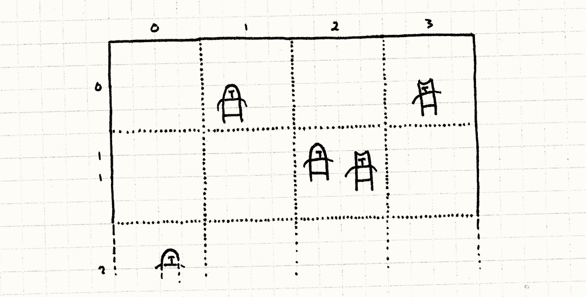
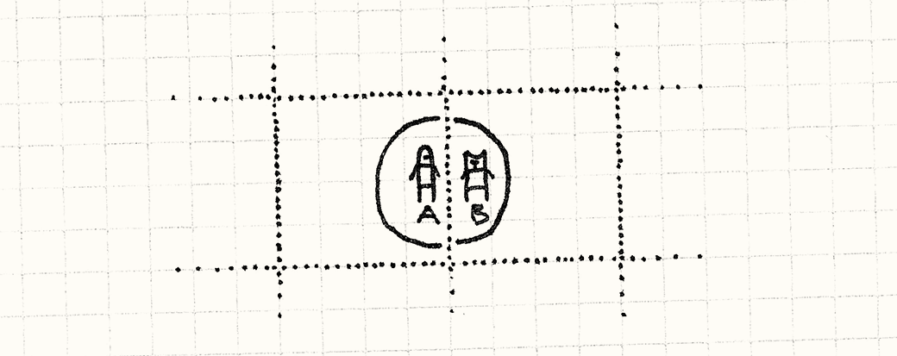
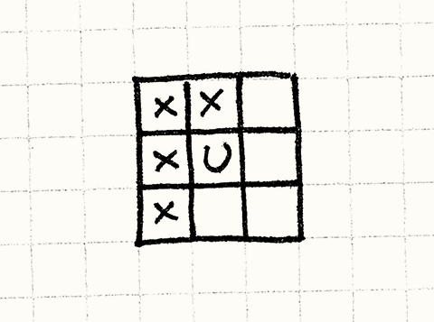
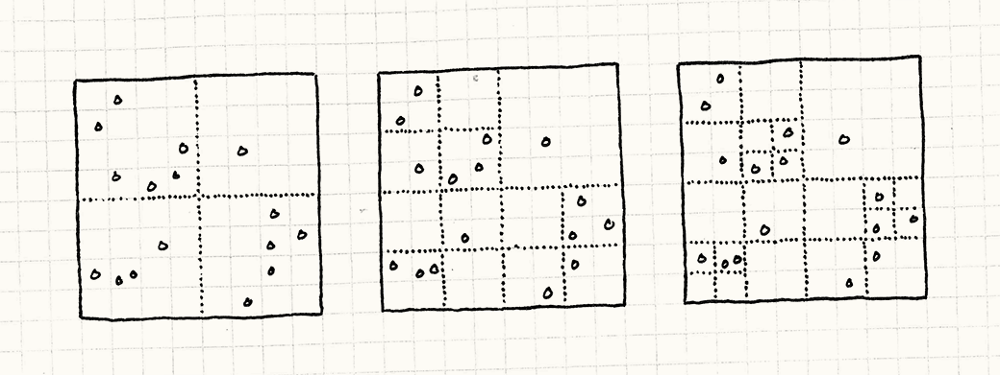

空间分区
============================

# 目的
将对象存储在根据位置组织的数据结构中来高效的定位对象。

# 动机
游戏允许我们来探寻其他世界，但这些世界和我们的世界有着明显的不同。他们通常与我们宇宙中共享着相同的基本物理规则和形体。这就是为什么他们看起来是那么的真实，尽管被制作成了位和像素点。

我们在这虚拟现实中将要关注的一点就是位置。游戏世界具有空间感，对象则分布于空间中的某处。这个体现于很多方式。一个明显的例子就是物理--对象的移动，碰撞和相互影响，但也有其他的例子。比如音频引擎会考虑声源与那些角色相关，从而更远的声音要相对安静点。在线聊天可能被限制在附近的玩家之间。

这意味着你的游戏引擎通常需要解决这个问题，“对象的附近有什么物体？”如果在每一帧中它不得不花费足够的时间来解决这个问题的话，那么就是遇到性能瓶颈了。

## 战场单元

假设我们在制作一款即时策略游戏。数百个敌军单位将聚集在战场上。勇士们需要知道他们附近有哪些敌军，简单的方式处理就是查看每一对单位看看他们彼此有多靠近。

```c++
void handleMelee(Unit* units[], int numUnits)
{
  for (int a = 0; a < numUnits - 1; a++)
  {
    for (int b = a + 1; b < numUnits; b++)
    {
      if (units[a]->position() == units[b]->position())
      {
        handleAttack(units[a], units[b]);
      }
    }
  }
}
```

这里我们用了一个双重循环，每一个循环遍历了战场上的所有单位。这意味着我们每一帧成对检验的次数随着单位个数的平方数而增加。每增加一个额外的单位，都要于所有前面的单位进行比较。当单位个数非常大时，便会失控。

> 注：内循环并没有遍历所有的对象。它只是遍历了外循环还没有访问过的对象。这样就避免了对每一对单位进行两次比较，每一次顺序不同而已。如果我们已经处理过了 A和 B 之间的碰撞，我们就
不再需要再次检测 B 和 A 之间的碰撞。

> 在 Big-O 方面，尽管仍然是 O(n²)。

## 绘制战线

我们遇到的问题是单位数组没秩序可循。为了找到某处位置附近的单位，我们不得不遍历整个数组。现在，想象一下我们简化下这个游戏。我们将战场想象成1维战场线，而不是2维的战场。


在这种情况下，我们通过单位在战场线上的位置来将数组排序可以让事情变得更简单点。一旦我们做到了这点，我们变可以使用类似[二分查找](http://en.wikipedia.org/wiki/Binary_search)的方式来寻找附近的单位而不是遍历扫描整个数组。

> 注：二分查找复杂度为 O(log n)，意味着寻找所有战场单位复杂度从 O(n²) 降到了 O(n log n)。像[鸽巢排序](http://en.wikipedia.org/wiki/Pigeonhole_sort)的算法可以将复杂度降到 O(n)。

我们来举一反三下：如果我们将我们的对象用他们的位置信息来组织存储为一个数据结构，我们就能更快的查找到他们。这个模式便是将这个想法应用到了超越1维的空间。

# 关于该模式

对于一组对象而言，每一个对象在空间都有一个位置。将对象存储在一个根据对象的位置来组织对象数据结构中，该数据结构可以让你高效的查询靠近某处的对象。当对象的位置变化时，更新该空间数据结构以便可以持续查找对象。

# 使用情境

这是一个常见的模式，用来存储存活的，移动的游戏对象以及静态图像和游戏世界的几何形状。复杂的游戏常常有多个空间分区来应对不同类型的内容。

该模式的基本要求是你有一组对象，每个对象都有某种位置信息，而你因为要根据位置做大量的查询来查找对象从而遇到了性能问题。

# 使用须知

空间分区将 O(n) 或者 O(n²) 操作变得更易于管理。对象越多，模式的价值就越大。相反，如果你的 n 很小，可能不值得使用这个模式。

由于这种模式要根据对象的位置来组织对象，对象改变位置就变得难以处理。你必须重新组织数据结构来跟踪物体的新位置，这会增加了代码的复杂性和花费的CPU周期。确保这么做是值得的。

> 注：想象一下，一个哈希表如果哈希对象的键可以自发的改变，你就会感觉到为什么棘手了。

想象一下，一个哈希表，其中的哈希对象的键就可以自发地改变，你就会更好的体会到为什么棘手。一个空间分区还使用额外的内存来保存数据结构。就像许多的优化一样，它是以空间换取速度。如果在时钟周期内内存吃紧的话，这可能是个亏本生意。

# 范例代码

模式的本质就在于他们的变化性--每一个实现都有所不同，虽然不像其他的模式，许多这样的变化都文档证据充分。学术界喜欢发表论文来证明性能上的提升。因为我只关心模式背后的概念，所以我准备为你展示最简单的空间分区：一个固定的表格。

> 注：查看本章节最后一部分列举的游戏中最常见的一些空间分区方法。

## 一张方格纸

设想一下战场的整个区域。现在，将固定大小的正方形拼接起来就像一张方格纸一样。我们不将我们的单位存储在一个单一的数组中，相反的，我们将他们放在这个表格的单元格中。每一个单元格从存储着一系列单位，他们的位置就在单元格的边界之内。



我们在处理战斗时，只考虑在同一个单元格内的单位。我们不会将每个单位与游戏中的其他单位一一比较，取而代之的是，我们已经将战场划分成了一堆更小的小型战场，每一个小战场里有着少的多的单位。

## 单位被链接起来的表格

好的。让我们开始编码。首先，做些准备工作。下面是`Unit`类：

```c++
class Unit
{
  friend class Grid;

public:
  Unit(Grid* grid, double x, double y)
  : grid_(grid),
    x_(x),
    y_(y)
  {}

  void move(double x, double y);

private:
  double x_, y_;
  Grid* grid_;
};
```

每一个单位都有一个位置（二维空间中）和一个指向`Grid`的指针。我们将`Grid`做为友元类，因为就像我们看到的，当一个单位的位置发生改变时，我们不得不对 grid 进行处理确保一切都更新正常。

下面是`Grid`的大体样子：

```c++
class Grid
{
public:
  Grid()
  {
    // Clear the grid.
    for (int x = 0; x < NUM_CELLS; x++)
    {
      for (int y = 0; y < NUM_CELLS; y++)
      {
        cells_[x][y] = NULL;
      }
    }
  }

  static const int NUM_CELLS = 10;
  static const int CELL_SIZE = 20;
private:
  Unit* cells_[NUM_CELLS][NUM_CELLS];
};
```
注意到每一个`cell`都是指向一个`unit`的一个指针。下面我们将用`next`和`prev`指针来扩展`Unit`：

```c++
class Unit
{
  // Previous code...
private:
  Unit* prev_;
  Unit* next_;
};
```
这下我们就能用一个[双重链表](http://en.wikipedia.org/wiki/Doubly_linked_list)来组织单位来取代数组了。


表格中的每个`cell`(单元格)都会指向单元格之内的单位列表的第一个单位，而每个单位都有指针用来指向列表中之前和之后的单位。我们很快就了解为什么这么做。

> 注：在这本书中，我避免使用了 C++ 标准库的任何内建集合类型。我想要用尽可能少的外部知识来理解这些例子，而且，就像魔术师的“nothing up my sleeve”，我想描述更清楚代码做了
什么。细节很重要，尤其设计到性能相关时。

> 但这是我解释模式时的一个选择。如果你在实际编码使用时，自己搞定所用语言的内建集合类型。生命短暂无需从头开始编写链表。

## 进入战场

我们需要做的第一件事就是将新创建出来的单位放到表格中。我们使用`Unit`类的构造函数来处理：

```c++
Unit::Unit(Grid* grid, double x, double y)
: grid_(grid),
  x_(x),
  y_(y),
  prev_(NULL),
  next_(NULL)
{
  grid_->add(this);
}
```
`add()`方法实现如下：

```c++
void Grid::add(Unit* unit)
{
  // Determine which grid cell it's in.
  int cellX = (int)(unit->x_ / Grid::CELL_SIZE);
  int cellY = (int)(unit->y_ / Grid::CELL_SIZE);

  // Add to the front of list for the cell it's in.
  unit->prev_ = NULL;
  unit->next_ = cells_[cellX][cellY];
  cells_[cellX][cellY] = unit;

  if (unit->next_ != NULL)
  {
    unit->next_->prev_ = unit;
  }
}
```

> 注：除以单元格的尺寸将世界坐标转换到了单元格坐标。然后使用int类型来截断小数部分，就到了单元格的索引。

代码有点像链表代码一样挑剔，但基本思想很简单。我们找到单位所处的单元格然后将它添加到链表的前面。如果单位列表已经存在，我们将它链接到新单位的后面。

## 刀光剑影的战斗

当所有单位被置入单元格后，我们便让他们开始相互攻击。在`Grid`类中，处理战斗的主要函数如下：

```c++
void Grid::handleMelee()
{
  for (int x = 0; x < NUM_CELLS; x++)
  {
    for (int y = 0; y < NUM_CELLS; y++)
    {
      handleCell(cells_[x][y]);
    }
  }
}
```
上面的方法遍历了每一个单元格，并且调用`handleCell()`。正如你所见，我们确实已经将大战场切分成了一些孤立的小规模冲突。每个单元格处理战斗函数如下：

```c++
void Grid::handleCell(Unit* unit)
{
  while (unit != NULL)
  {
    Unit* other = unit->next_;
    while (other != NULL)
    {
      if (unit->x_ == other->x_ &&
          unit->y_ == other->y_)
      {
        handleAttack(unit, other);
      }
      other = other->next_;
    }

    unit = unit->next_;
  }
}
```

Aside from the pointer shenanigans to deal with walking a linked list, note that this is exactly like our original naïve method for handling combat. It compares each pair of units to see if they’re in the same position.

The only difference is that we no longer have to compare all of the units in the battle to each other — just the ones close enough to be in the same cell. That’s the heart of the optimization.

> 注意：简单分析下，看起来我们这么做使得性能变得更差。我们将单元格遍历一个双重嵌套循环变成了三重嵌套循环。但这里的窍门是，这两个内部循环现在遍历的数目已经很少了，这将足以
抵消外部循环遍历的单元格的代价。

> 不过，这个并不取决于我们单元格的颗粒度。让单元格变得更小对于外部循环来说无关紧要。

## 移动
我们已经解决了性能问题，但却遇到了一个新的问题。单位现在都被困在了单元格里面。如果将单位从它所在的单元格移动出去，那么这个单元格中的其他单位将不会再看到这个单位，而其他任何单位也不会再看到。我们战场分区分的有些过了。

为了修复这个问题，我们还需要在单位每次移动的时候做一点工作。如果单位越过了单元格的边界线，我们需要将单位从单元格移除掉并且添加到新的单元格中。首先，我们给`Unit`类添加一个方法来改变它的位置：

```c++
void Unit::move(double x, double y)
{
  grid_->move(this, x, y);
}
```
从使用上看，这段代码可以被计算机控制的单位的AI代码调用，也可以被玩家控制单位的用户输入代码控制。它所做就是将控制权交给 grid，grid 的 move 如下：

```c++
void Grid::move(Unit* unit, double x, double y)
{
  // See which cell it was in.
  int oldCellX = (int)(unit->x_ / Grid::CELL_SIZE);
  int oldCellY = (int)(unit->y_ / Grid::CELL_SIZE);

  // See which cell it's moving to.
  int cellX = (int)(x / Grid::CELL_SIZE);
  int cellY = (int)(y / Grid::CELL_SIZE);

  unit->x_ = x;
  unit->y_ = y;

  // If it didn't change cells, we're done.
  if (oldCellX == cellX && oldCellY == cellY) return;

  // Unlink it from the list of its old cell.
  if (unit->prev_ != NULL)
  {
    unit->prev_->next_ = unit->next_;
  }

  if (unit->next_ != NULL)
  {
    unit->next_->prev_ = unit->prev_;
  }

  // If it's the head of a list, remove it.
  if (cells_[oldCellX][oldCellY] == unit)
  {
    cells_[oldCellX][oldCellY] = unit->next_;
  }

  // Add it back to the grid at its new cell.
  add(unit);
}
```
上面代码较多，但是却很简单。我们首先检查单位是否越过了单元格的边界。如果没有，我们只需要更新单位的位置就完成了。

如果单位离开了所在的单元格，我们将它从单元格的链表中移除掉，然后将之添加到 grid 上。就像添加一个新单位一样，这样会将单位插入到链表中对应着新的单元格。

这就是为什么我们会使用一个双重链表--我们通过设定少量几个指针就可以非常快速的从链表中添加和移除单位。在每一帧有着大量的单位移动时，这样就显得非常重要。

## 近在咫尺，短兵相接

这个似乎看起来很简单，但是我用某种方式作了弊。在例子中，当单位出在相同位置时才会相互作用。对于跳棋和国际象棋是没问题的，但是对于更逼真的游戏来说就不适用了。那些通常要考虑到攻击距离。

这种模式仍然工作良好。不检查位置是否精确的匹配，我们这么做：

```c++
if (distance(unit, other) < ATTACK_DISTANCE)
{
  handleAttack(unit, other);
}
```

当范围足够接近，我们需要考虑到一种情况：在不同的单元格内的单位也可以足够靠近来相互作用。



像上图中，B在A的攻击范围内即便他们的中心点位于不同的单元格。为了处理这种情况，我们不仅需要相同单元格的单位，还要比较相邻单元格的单位。为达目标，首先我们将`handleCell()`的内循环切分开来。

```c++
void Grid::handleUnit(Unit* unit, Unit* other)
{
  while (other != NULL)
  {
    if (distance(unit, other) < ATTACK_DISTANCE)
    {
      handleAttack(unit, other);
    }

    other = other->next_;
  }
}
```
现在我们的函数会采用一个单一的单位和链表的其他单位来判断是否有相互作用。然后我们用`handleCell()`这么做：

```c++
void Grid::handleCell(int x, int y)
{
  Unit* unit = cells_[x][y];
  while (unit != NULL)
  {
    // Handle other units in this cell.
    handleUnit(unit, unit->next_);

    unit = unit->next_;
  }
}
```

注意到我们将单元格的坐标也传入了进去，而不只是单位链表。眼下，这个和上面的例子做的事情没有什么不同，但我们将会稍微的扩展下：

```c++
void Grid::handleCell(int x, int y)
{
  Unit* unit = cells_[x][y];
  while (unit != NULL)
  {
    // Handle other units in this cell.
    handleUnit(unit, unit->next_);

    // Also try the neighboring cells.
    if (x > 0 && y > 0) handleUnit(unit, cells_[x - 1][y - 1]);
    if (x > 0) handleUnit(unit, cells_[x - 1][y]);
    if (y > 0) handleUnit(unit, cells_[x][y - 1]);
    if (x > 0 && y < NUM_CELLS - 1)
    {
      handleUnit(unit, cells_[x - 1][y + 1]);
    }

    unit = unit->next_;
  }
}
```
`handleUnit()``函数用来寻找当前单位和相邻8个单元格中的4个单位之间的击打。如果在相邻单元格中的任何单位离当前单位的攻击半径足够近，它将找到击打。

> 注：单位所在的单元格标记为 U， 相邻单元格标记为了 X。

> 

我们只查看一半相邻的单元格，和内部循环在当前单位开始的原因一样----为了避免比较同对单位两次。考虑下如果我们检查8个相邻单元格会发生什么。
我们仅看一半的邻居，该内环在当前单元之后开始同一原因 - 为了避免比较各对单元两次。试想，如果我们做检查所有八个相邻小区会发生什么。

比方说，就像前面的例子一样，在相邻的单元格内，我们有两个单位足够接近击中对方。如果我们查看单位周围所有的8个单元格，以下就是会发生的事情：

1.当要寻找 A 的攻击时，我们会查看它右边的邻居，并且发现了 B。所以我们登记下 A 和 B 之间的攻击。

2.然后，当寻找 B 的攻击时，我们会查看它左边的邻居，并且发现了 A，所以我们登记下了 A 和 B 之间的第二次攻击。

仅仅查看一半的邻居便可修复这个问题。至于哪一半并不要紧。

还有一个情况我们也需要考虑下。在这里，我们假设最大的攻击距离要比一个单元格小。如果我们有着较小的单元格但却较大的攻击距离时，我们可能需要扫描一堆相邻的单元格，它们可能横跨了
好几行。

# 设计决策

明确定义的空间分区的数据结构有一个相对简短的一个列表，这里本可以一个一个来看下。相反，我试图根据他们的本质特征来组织这一点。我希望一旦你了解到四叉树和二叉空间分割（BSP）
之类时，这将有助于你了解他们是如何工作的，为什么这么工作以及在这之间做出选择。

## 分区是层级的还是扁平的？

在网格例子中，我们将网格划分成了一个单一扁平的单元格集合。与此相反，层级空间分区只是将空间划分成几个区域。然后，如果这些区域中仍然包含着许多的对象，会继续划分。这个过程递归
持续到每个区域的对象数目要比对象的一些最大数目要少。

> 注：他们通常会切分2、4、8个区域，这些数字对程序员而言非常漂亮。


### 如果它是一个扁平的分区：

1.相对简单点。扁平的数据结构相对来说更容易推理和实现。

> 注：我几乎在每个章节中都会提到这点，并且理由十足。无论何时，采取相对简单点的方案。软件工程大部分都是在和复杂性对抗。

2.内存使用恒定。由于添加新对象不需要创建新的分区，所以空间分区使用的内存通常可以提前固定。
3.当对象改变位置时可以更为快速的更新。当一个对象移动，数据结构需要更新以找到对象的新位置。使用层级空间分区，这可能意味着调整层次结构的若干层。

### 如果它是一个层级的分区：

1.它可以更有效的处理空的空间。想想一下，在我们前面的例子中，如果战场的一整面是空的，我们就会有大量的空单元格，而我们不得不在每帧中分配内存和遍历。

因为层级空间分区不会细分稀疏区域，所以一个大的空白空间仍然是一个单独的分区，而不是大量细小的分区。

2.它处理对象稠密区域时更为有效。这是硬币的另一面：如果你有一堆对象成群的在一起，非层级分区是低效的。你最终会有一个有着许多对象的分区而你可能却无法对之进行分割。层级分区将会
自适应细分成更小的分区，使得你一次只需考虑少数几个的对象。

## 分区依赖于对象集合吗？

在我们的示例代码中，网格的间距是预先固定的，并且我们将单位放置进入了单元格中。其他的分区方案是自适应的，他们根据实际的对象集合以及他们在世界中的位置来选择分区的边界。

我们的目标是有一个均衡的分区，每一个分区都有着大致相同的对象个数以获得最佳的性能。考虑以我们的网格例子，如果所有单位都集中在了战场的一个角落，他们将会处在同一个单元格内，找寻
单位间攻击的代码会回到原来的 O(n²) 问题，而这个正是我们试图要解决的问题。

### 如果分区依赖于对象：

1.对象可以逐步被添加。添加一个对象意味着要找到正确的分区并且将对象放置进去，所以你可以一次完成这个而没有任何性能问题。

2.对象可以快速的移动。对于固定的分区，移动一个单位意味着要将单位从一个单元格中移除然后添加到另外一个单元格。如果分区边界本身基于对象集合来改变，那么移动对象会引起边界的移动，
这样会引起大量其他的对象需要被移动到不同的分区。

> 注意：这个很类似于红黑树或者AVL树这样的二叉搜索树：当你添加一个单一的item时，你可能最终需要对数进行重新排序并且对周围的一堆节点洗牌移动。

3.分区可以不平衡。当然，这么做会让你对均匀分布的分区只有较少的控制。如果对象拥挤到一起，你会得到一个糟糕的性能表现因为在空白区域浪费了内存。

### 如果分区自适应于对象集合：

像二叉空间分割和 k-d 树这样的空间分区会递归的将世界分割开来，以使得每部分包含着数目相同的对象。要做到这点，你必须要计算当选择分区部分时在每一边对象的数目。边界体积层次结构是
空间分区中的另外一种类型，用于优化世界中的特定对象集合。

1.你可以确保分区平衡。这不仅仅带来优秀的性能表现，而且会是持续稳定的表现：如果每个分区有着相同数量的对象，你便可以确保对世界中的分区的查询需要大约相同的时间量。当需要维持一个
稳定的帧速率，这种稳定性比原始的性能更为重要。

2.对整个对象集合一次性的进行分区更为有效。当对象集合影响到边界时，最好在分区之前对所有对象进行审视。这就是为什么这种类型的分区越来越多的应用于游戏中需要保持固定的图形和静态几何部分。

### 如果分区不依赖于对象，而层级却依赖于对象：

有一个空间分区特别值得一提，因为它在固定分区和自适应上有着最好的特性：四叉树。

> 注：四叉树分割了2维空间。3维模拟的是八叉树，这个需要体积和将之分割成8个立方体。除了额外的唯独，它工作的原理和四叉树一样。

四叉树从将整个空间作为一个单一的分区开始。如果空间中对象的的数目超过了某一个阈值，空间便被切分成四个较小的正方形。这些正方形的边界是固定的：他们总是将空间对半切分。

然后，对于四个正方形中的每一个而言，我们再一次做了同样的过程，递归，直到每一个正方形内部只有少量的对象。由于我们只是递归的将高密度对象区域切分开，这个分区会自适应于对象集合，
但分区不会移动。

在下图中，从左往右阅读，你可以看到分区的过程：



1.对象可以逐步的增加。添加一个新对象意味着要寻找合适的区域并且放置进去。如果对象放入区域中超过了最大的数目，那么区域会被继续细分。在区域中的其他对象也会被分到更细小的区域中去。
这需要一些工作，但是努力是值得的：你必须要移动的对象的数目始终要比最大的对象数目要少。添加一个单一的对象永远也不会触发多个细分动作。

删除的对象同样简单。你将对象从它所在区域中移除，如果它的父区域的对象总数低于了一个阈值，你就可以合并这些细分的区域。

2.对象可以快速的移动。这个，当然，和上面一样。“移动”一个对象只是一个添加和一个删除，两者和四叉树一样，相当快。

3.分区是平衡的。由于任何给定的区域中的对象数目都比对象的最大的数目要小，即使对象聚集在一起，你也不必用一个单一的分区来容纳这些大量的对象。

## 对象只存储在分区中吗？

你可以将空间分区看作是游戏中对象存活的地方，或者你可以将它考虑只当作是二级缓存，相比直接持有对象列表的集合而言，查询能够更快速。

### 如果它是对象唯一的存储的地方：

这个避免了两个集合的内存开销和复杂性。当然，将东西存成一份要比两份代价要小。另外，如果你有两个集合，你必须确保集合间的同步。每次当一个对象被创建或者被删除，将不得不从两者中
添加或者删除。

### 如果存在存储对象的另外一个集合：

遍历所有的对象更为快速。如果问题中对象是“存活”的并且他们需要做一些处理，你可能会发现自己要频繁的访问每一个对象，无论对象的位置在哪。试想一下，在我们前面的例子中，大部分单元格
都是空的。遍历表格中所有单元格找到非空的那些单元格是在浪费时间。

第二个集合只存储那些可以让你直接遍历访问的对象。你有两个数据结构，其中一个针对每个用例进行了优化。

# 其他参考

-  在这章中我试图不去详细讨论空间分区的结构，以保持章节的高层次概括性（并且也不会太长！），但是下一步你应该要去了解一些常见的结构。尽管他们的名字吓人，但却出奇的简单。常见的有：

    -  [网格](http://en.wikipedia.org/wiki/Grid_(spatial_index)
    -  [四叉树](http://en.wikipedia.org/wiki/Quad_tree)
    -  [二叉空间分割](http://en.wikipedia.org/wiki/Binary_space_partitioning)
    -  [k-dimensional树](http://en.wikipedia.org/wiki/Kd-tree)
    -  [层次包围盒](http://en.wikipedia.org/wiki/Bounding_volume_hierarchy)

-  每一个空间数据结构基本都从一个现有已知的1维数据结构扩展到多维，了解他们的线性结构会帮助你判断他们是否适合解决你的问题：

    -  网格是一个持久的[桶排序](http://en.wikipedia.org/wiki/Bucket_sort)。
    -  二叉空间分割, k-d 树, 以及层次包围盒都是[二叉查找树](http://en.wikipedia.org/wiki/Binary_search_tree)。
    -  四叉树和八叉树都是[Trie树](http://en.wikipedia.org/wiki/Trie)（译者注：Trie树是哈希树的变种）。
